# Castle — 3D Multiplayer Chess with Next.js 16, Vercel Eve & Clerk

[](https://nextjs.org/)
[](https://go.clerk.com/sonny)
[](https://www.convex.dev/)
[](https://threejs.org/)
[](https://stockfishchess.org/)
[](https://vercel.com/)
[](https://ai-sdk.dev/)
[](https://react.dev/)
[](https://tailwindcss.com/)
[](https://www.typescriptlang.org/)

**Chess you can walk around.** Sit at a physically lit 3D board, choose your room, and play a person near your rating or an AI opponent with a personality. Ask the Pro tutor about a position and watch it draw the explanation directly on your board.

Castle brings together **realtime multiplayer, browser-based Stockfish, AI commentary, visual coaching, authentication, subscriptions, and a live rating system** in one Next.js application.

[**Open the demo →**](https://chess-3d-ai-clerk-game.vercel.app) · [**Get started with Clerk →**](https://go.clerk.com/sonny) · [**Join the free AI Community →**](https://www.papareact.com/ztoh-form)

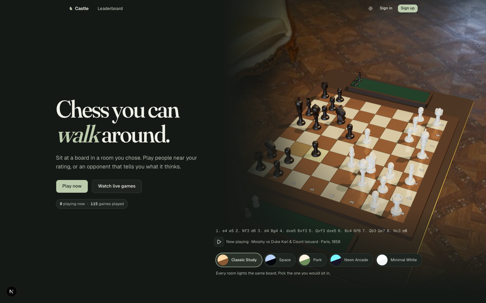

> **Who is this for?** Developers who want to build a substantial full-stack application with realtime data, interactive 3D graphics, AI tools, and a paid feature. The explanations below follow the code from a click on a square to the database transaction, and from a tutor question to an arrow on the board.

> **What makes it different?** Three systems have distinct jobs: **chess.js enforces the rules**, **Stockfish calculates candidate moves**, and **the language models choose or explain ideas**. Convex owns the saved game. Both board renderers display that same game, and Clerk owns identity and subscription access.

> **About this demo:** Castle is an educational build. The documented demo configuration uses Clerk's development instance and test billing. Screenshots were captured before the final room-art refresh, so the Study surroundings differ from the latest source. Game, profile, leaderboard, and tutor screenshots below use the application's development previews with sample data; tutor conversations in those previews are scripted. They illustrate the real UI components, not a recorded live model response. See the [screenshot capture notes](docs/assets/README.md) for provenance. The landing and Pro images are captures of public pages. Local source may be ahead of the hosted demo.

**Under the hood:** Next.js **16.3.4** · React **19.2.8**, React Compiler enabled · Clerk **7** · Convex **1.45** · React Three Fiber **9** + Drei **10** + Three.js **0.185** · chess.js **1.4** · Stockfish **18**, with an **11** compatibility fallback · Eve **0.52.4** · Vercel AI SDK **7** · Tailwind CSS **4** · shadcn/ui + Base UI · Zustand **5** · TypeScript · Node **24+** · pnpm **11.24.0**.

These describe this build, not a claim that every dependency is the latest available release. Exact dependency resolutions live in [`pnpm-lock.yaml`](pnpm-lock.yaml).

---

## 👇🏼 DO THIS Before You Get Started

1️⃣ Sign up to Clerk 👉 **[https://go.clerk.com/sonny](https://go.clerk.com/sonny)**

2️⃣ Create your Convex account 👉 **[https://www.convex.dev/](https://www.convex.dev/)**

3️⃣ Join my new AI Community for FREE! 👉 **[https://www.papareact.com/ztoh-form](https://www.papareact.com/ztoh-form)**

| Service | What it does in this build | Get started |
| --- | --- | --- |
| **Clerk** | Sign-up, sign-in, usernames, avatars, sessions, user subscriptions, and the `tutor` entitlement | **[Create your Clerk account →](https://go.clerk.com/sonny)** |
| **Convex** | Database, reactive queries, game mutations, matchmaking, presence, rating history, file storage, and player-chat persistence | [Create your Convex account →](https://www.convex.dev/) |
| **Vercel** | Next.js hosting, the deployed Eve service, and AI Gateway access to the configured models | [Create your Vercel account →](https://vercel.com/signup) |
| **Stockfish** | Calculates chess moves inside the player's browser; the checked-in engine needs no API key | [Explore Stockfish →](https://stockfishchess.org/) |

You do not need a separate SQL database, a hand-written WebSocket server, or an Anthropic API key for the integration as written. The model calls use **Vercel AI Gateway credentials**. Hosted services and model usage can have costs; core chess engine calculation runs locally in the browser.

---

## 🧭 Inside This README

- [What is Castle?](#-what-is-castle)
- [Features and screenshots](#-features-and-screenshots)
- [Architecture](#-architecture)
- [Chess rules and server authority](#-chess-rules-and-server-authority)
- [Stockfish and the AI opponent](#-stockfish-and-the-ai-opponent)
- [The visual tutor](#-the-visual-tutor)
- [Clerk authentication and billing](#-clerk-authentication-and-billing)
- [Matchmaking, presence, and ratings](#-matchmaking-presence-and-ratings)
- [3D rendering and shared state](#-3d-rendering-and-shared-state)
- [Database and routes](#-database-and-routes)
- [Getting started](#-getting-started)
- [Demo walkthrough](#-demo-walkthrough)
- [Testing and verification](#-testing-and-verification)
- [Deployment](#-deployment)
- [Troubleshooting](#-troubleshooting)
- [Take it further](#-take-it-further)
- [Quick reference](#-quick-reference)
- [Licences and attribution](#-licences-and-attribution)

---

## 🤔 What Is Castle?

Castle is an online chess club with three ways to play and a tutor you can bring into the game.

**As a player, you can:**

- Find a rated online opponent through a queue that widens its rating range as you wait.
- Play one of five AI opponents, each with a different strength and voice.
- Play a friend on one device with a board that can turn between moves.
- Switch between 2D and 3D during a game, change rooms, and adjust the camera.
- Watch online games, review previous moves, and export a game as PGN.
- Track your overall rating, human-opponent rating, and AI-opponent rating separately.
- Exchange private text messages with the other player in an online game.
- Subscribe to Castle Pro and ask the tutor to explain and annotate the position in view.

**As a developer, you get:**

- A server-authoritative game loop with move validation and atomic result/rating updates.
- A client-side WASM engine integrated with a server-side language model.
- A multi-step tutor with browser-executed analysis and schema-validated drawing tools.
- Clerk authentication shared across Next.js and Convex, plus a server-side paid feature gate.
- Two board renderers behind one shared TypeScript contract.
- Development previews, unit tests, Convex function tests, and Playwright flows.

The same patterns are useful beyond chess: multiplayer tabletop games, realtime collaboration, visual tutoring, interactive simulations, and products where an AI explains structured application state.

---

## ✨ Features and Screenshots

### Three ways to play

| Mode | How it works | Rating behavior |
| --- | --- | --- |
| **Online** | Join the queue, match with another player, receive moves live, offer draws, chat, or resign | Rated; take-backs disabled |
| **Against the AI** | Choose a persona, difficulty, and colour; Stockfish and the model produce the opponent's moves | Rated initially; the first take-back makes the game unrated |
| **Pass and play** | One signed-in player owns the game; two people take turns on the same device | Always unrated |

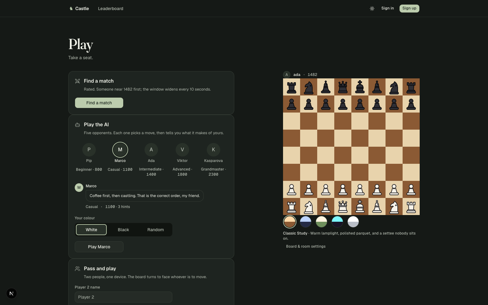

### A real 3D board

- Physical piece meshes, square selection, move highlights, captures, and trays.
- Five rooms: **Classic Study**, **Space**, **Park**, **Neon Arcade**, and **Minimal White**.
- A **Custom** room with colour controls and an optional uploaded backdrop.
- White, Black, Top, and cinematic camera choices, with orbit, pan, and zoom controls.
- 2D mode, quality controls, automatic graphics degradation, and a WebGL fallback.
- Room preferences belong to each viewer: your opponent can see a different environment around the same position.

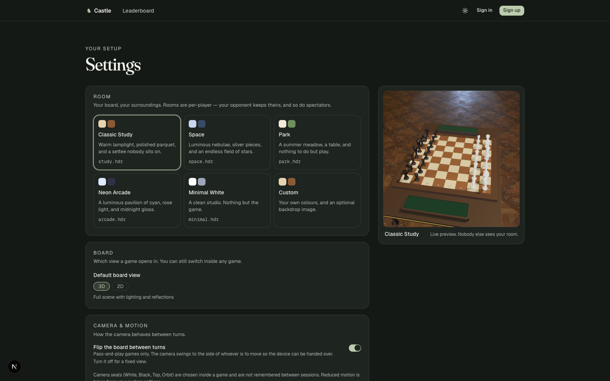

### Realtime multiplayer and player chat

Online games have live state, draw offers, resignation, presence, and a private chat between the two seated players. The sidebar provides **Chat**, **Moves**, and **Info** tabs.

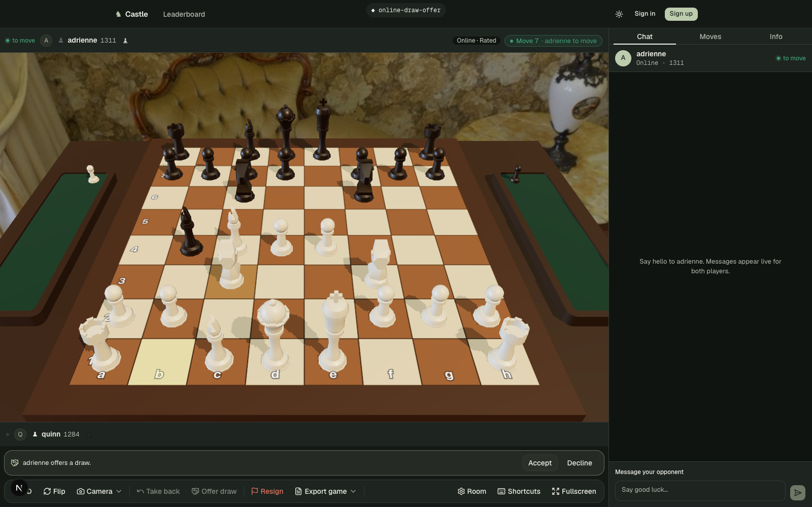

Player chat uses the `@convex-dev/agent` component as a **message store**. There is no model call in that flow. Queries and sends both check that the caller is a participant in the online game; spectators cannot read the chat. Messages are trimmed, limited to 1,000 characters, and the current query returns up to 200 messages.

### Five AI opponents

| Opponent | Difficulty | Personality | Fixed rating used by the app |
| --- | --- | --- | --- |
| **Pip** | Beginner | Cheerful newcomer, encouraging and a little nervous | 800 |
| **Marco** | Casual | Chatty café player with light jokes | 1,100 |
| **Ada** | Intermediate | Patient coach who names the idea behind a move | 1,400 |
| **Viktor** | Advanced | Dry, confident tournament player | 1,800 |
| **Kasparova** | Grandmaster | Imperious, with cutting one-liners | 2,300 |

These ratings are **configuration values for Castle's rating calculations**, not independently measured playing-strength claims. Beginner and Casual include **three hints per game**.

### Castle Pro: the tutor draws on your board

Ask **“Show me the threats”**, **“What's the plan here?”**, or a follow-up about the last answer. The tutor can mark squares, draw arrows, and display a legal candidate line as numbered arrows.

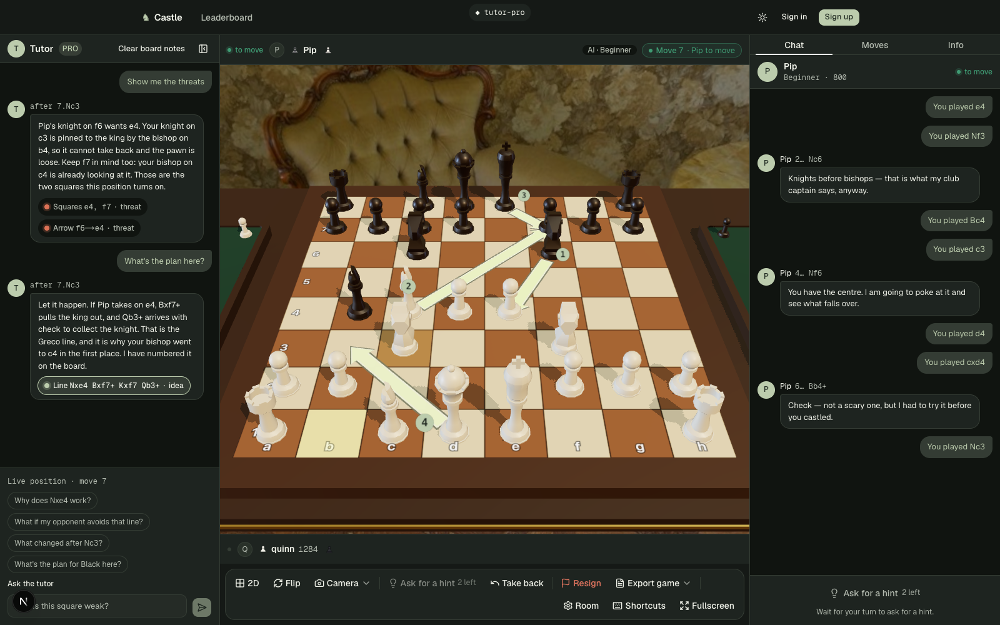

The same conversation and annotation contract work in 2D:

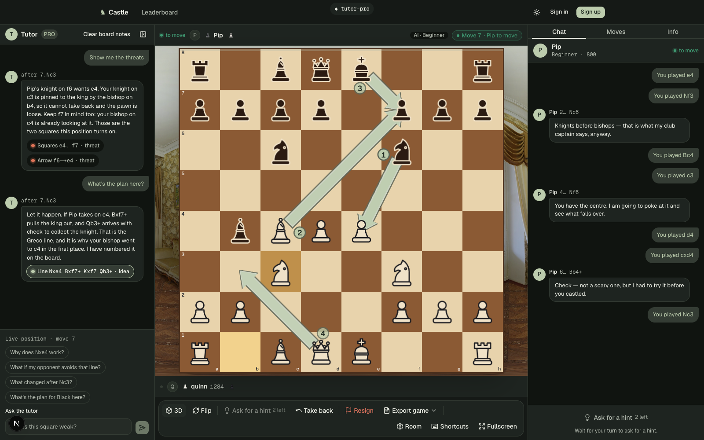

The tutor follows the position you are reviewing. Answers carry the move index they refer to, so an old explanation does not acquire the label of a different position when you rewind. Follow-up suggestions are derived from the position and recent answer. Drawings are invalidated when their originating move history or relevant pieces change.

### Profiles, history, and leaderboards

| Player profile preview | Leaderboard preview |
| --- | --- |
| 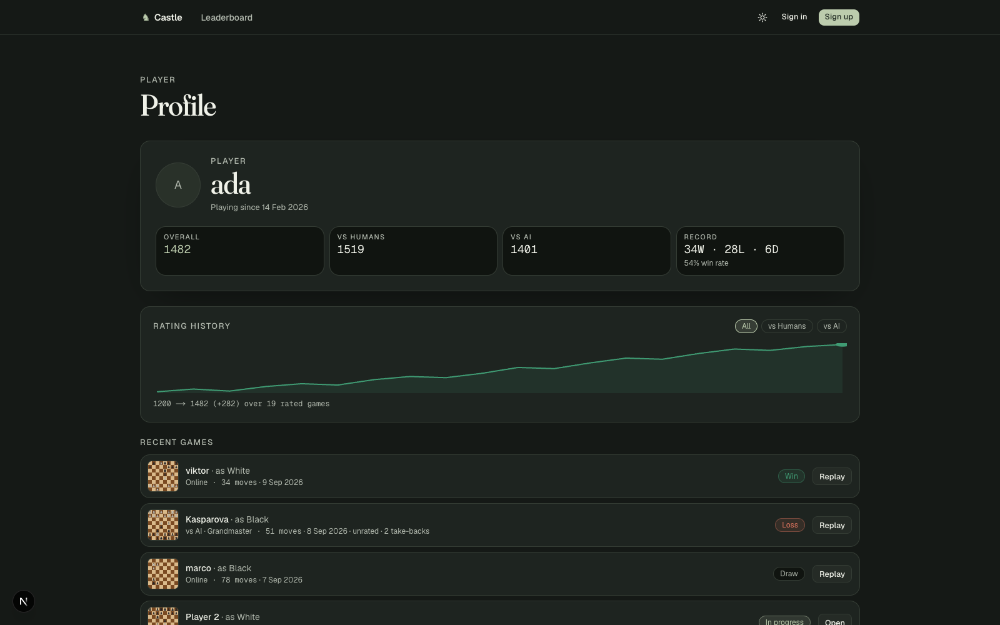 | 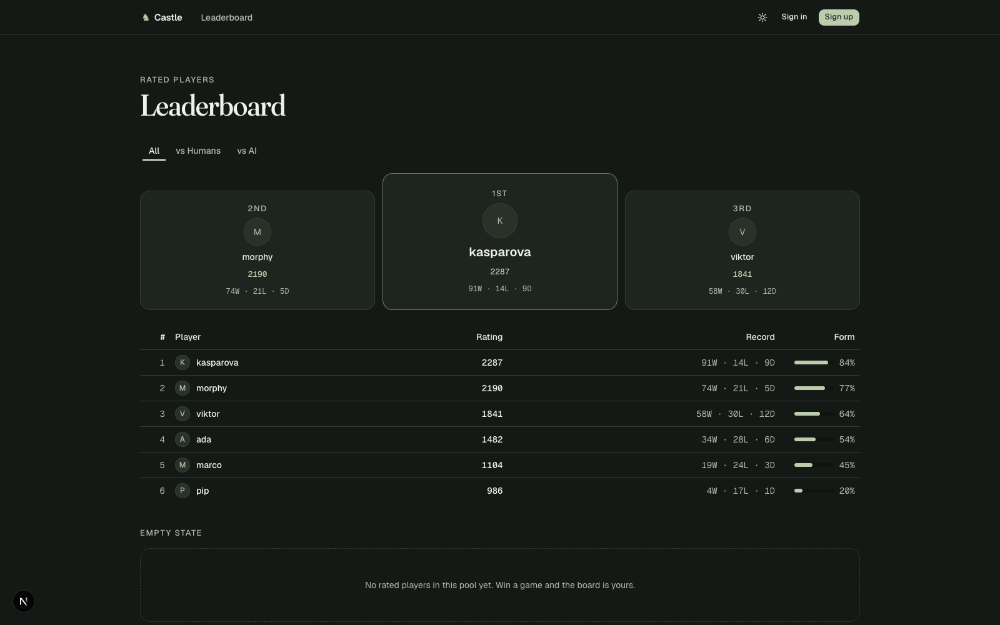 |

Profiles show a rating-history chart, win/loss/draw record, and recent games. The leaderboard supports **All**, **vs Humans**, and **vs AI**, with up to 100 entries.

### Subscription page and mobile layouts

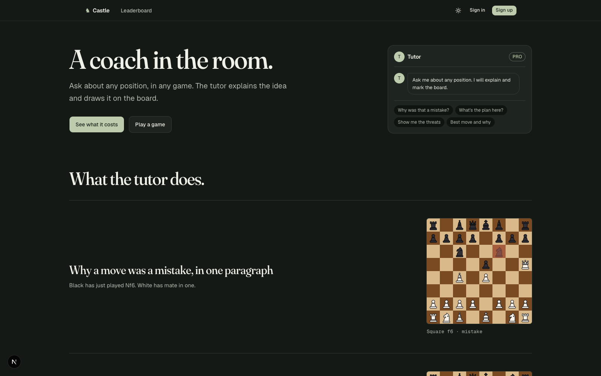

Castle Pro has one monthly user subscription. Clerk's pricing table renders the configured price, and Clerk's account interface handles subscription management. The tutor is the paid feature; the game modes, rooms, and AI opponents are available without Pro.

| Mobile board preview | Mobile tutor sheet preview |
| --- | --- |
| 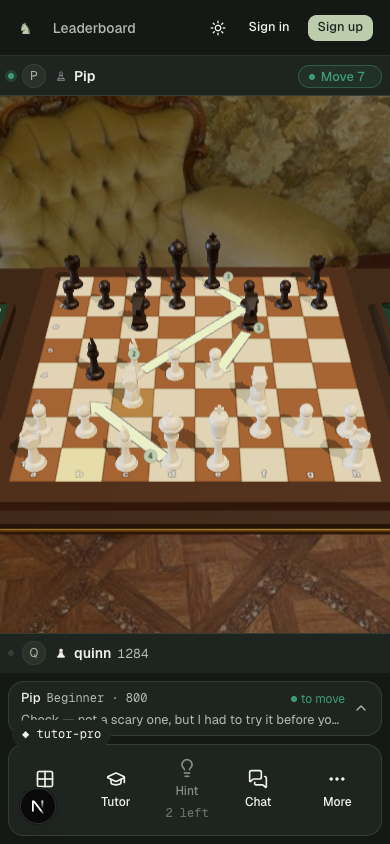 | 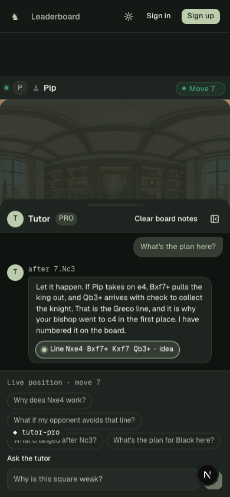 |

---

## 🔄 Architecture

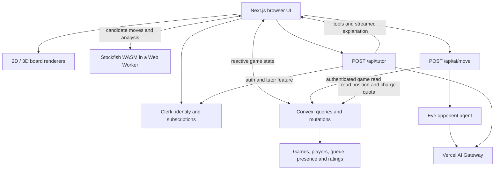

The systems have deliberately narrow responsibilities:

| Layer | Owns | Does not own |
| --- | --- | --- |
| **Clerk** | Identity, sessions, subscription features | Game positions or Elo |
| **Convex** | Saved game state, authorization for game actions, matchmaking, results | 3D camera position or LLM prose generation |
| **chess.js** | Legal moves, replay, game status, notation | Strategic move quality |
| **Stockfish** | Search, evaluations, candidate moves and lines | User permissions or subscriptions |
| **Opponent model** | Move choice from supplied candidates and in-character commentary | Direct writes to the game |
| **Tutor model** | Explanations and requests for analysis/drawings | Applying a player's next move |
| **React / Three.js** | Interaction, presentation, animation, camera and overlays | Authoritative results |

---

## ♟️ Chess Rules and Server Authority

### 1. Understand the three chess formats

| Format | Meaning | Example | Used for |
| --- | --- | --- | --- |
| **FEN** | A compact snapshot of a chess position | `rnbqkbnr/pppppppp/8/8/8/8/PPPPPPPP/RNBQKBNR w KQkq - 0 1` | Current board rendering and engine search |
| **SAN** | Human-readable move notation | `Nf3`, `O-O`, `Bxf7+` | Stored move history, replay, and explanations |
| **PGN** | A portable game record | `1. e4 e5 2. Nf3 Nc6` | Exporting the game |

A **ply** is one player's move. White's `e4` is one ply; Black's `e5` is the next. `moves.length` is therefore the game's current ply count.

The `games` document stores FEN and PGN for convenient reads, but the server **replays the SAN move list** to validate moves. History matters: a single position snapshot does not preserve the earlier positions needed to detect repetition.

### 2. A click becomes a request, not a new board supplied by the browser

The browser submits the intended move:

```ts
// Simplified input to games.makeMove
{
  gameId,
  from: "e2",
  to: "e4",
  // promotion: "q" // supplied when a pawn promotes
}
```

It does not submit an authoritative FEN or a new rating.

### 3. Convex checks the move

In [`convex/games.ts`](convex/games.ts), `makeMove`:

1. Resolves the signed-in player from the verified identity.
2. Loads the game and checks that it is active.
3. Checks the player's seat and whose turn it is; the local-game owner controls both sides.
4. Replays the saved moves through chess.js.
5. Requires a promotion choice when necessary.
6. Applies the legal move and derives the resulting position.
7. Saves the move, FEN, PGN, turn, and last-move metadata.
8. Finalizes the result and rating changes if the game has ended.

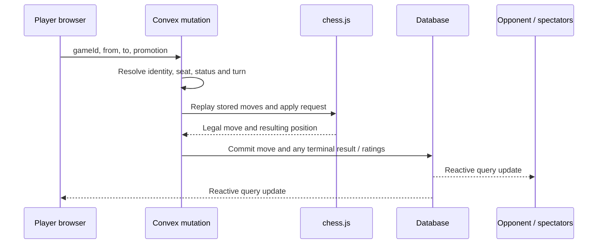

Castling, en passant, promotion, checkmate, stalemate, insufficient material, repetition, and the fifty-move rule are handled through the chess logic. The UI presents those outcomes rather than deciding them independently.

### 4. AI moves have an extra stale-result check

`makeAiMove` accepts `gameId`, `san`, and `expectedPly`. Before applying the move it checks the participant, mode, AI colour, turn, and legality, then verifies:

```ts
game.moves.length === expectedPly
```

A response calculated for an older board cannot be applied after a take-back or another state change. This also prevents a repeated submission from blindly applying the same AI result twice.

### 5. A correct rules engine is not an anti-cheat system

The server checks legality, ownership, and state consistency. **It does not prove that browser-supplied engine scores are honest.** AI candidates and analysis originate on the client, and AI moves are submitted by that client. Castle does not implement competitive anti-cheat. Its local ratings and named difficulty levels should be understood in that context.

---

## 🧠 Stockfish and the AI Opponent

### Part 1 — Why there are two kinds of AI

Stockfish searches chess positions. A language model explains ideas in ordinary language and provides the opponent's voice. Combining them lets the app produce calculated moves with commentary such as a coach naming a pin or a café player making a joke.

The configured opponent model is **`anthropic/claude-haiku-4.5`**, routed through AI Gateway. Its configuration is in [`agent/agent.ts`](agent/agent.ts).

### Part 2 — The engine runs in a Web Worker

Stockfish is compiled to **WebAssembly**, a binary format the browser can execute. The app creates a same-origin Web Worker so engine search runs away from the main UI thread.

The default binary is Stockfish 18's **lite, single-threaded** build. It uses NNUE evaluation and needs WASM SIMD support. It does **not** need `SharedArrayBuffer` or cross-origin isolation. If the browser fails the SIMD capability probe, Castle chooses the Stockfish 11 build automatically.

| Build | Used when | Existing project size notes |
| --- | --- | --- |
| **Stockfish 18** | Browser supports WASM SIMD | About 5.6 MB compressed for the engine payload |
| **Stockfish 11** | Browser lacks WASM SIMD | About 669 KB compressed |

Actual transfer sizes depend on hosting compression and caching. The WASM assets are served from [`public/stockfish/`](public/stockfish). The engine loads lazily for AI play and for tutor analysis when requested; an ordinary human game does not need to load it just to validate moves.

The worker uses URL strings such as `/stockfish/sf18/stockfish-18-lite-single.js`. This matters: bundling the worker through a transformed `new URL(...)` can interfere with the engine glue's WASM-path resolution. See [`docs/research/stockfish.md`](docs/research/stockfish.md).

### Part 3 — UCI is the conversation with the engine

**UCI**, the Universal Chess Interface, is a text protocol. A search is conceptually:

```text
uci
isready
setoption name MultiPV value 3
position fen <current-position>
go depth 10
```

The engine emits `info` lines containing search depth, score, and a principal variation, then `bestmove` when the search completes or is stopped. Castle parses these into typed candidate objects.

- **MultiPV** asks for several candidate lines rather than only the best line.
- **Depth** is a search target; a time budget can stop the search before it gets there.
- **Centipawns** express an evaluation in hundredths of a pawn.
- **Principal variation (PV)** is the engine's proposed continuation.
- A **mate score** is represented separately from a centipawn score.

### Part 4 — Difficulty changes the search and selection policy

Candidate generation runs at Stockfish Skill Level **20**, so the ranking is internally consistent. Difficulty then changes the search depth, candidate count, and how the chooser selects among those candidates.

| Difficulty | Target depth | MultiPV | Search cap | Selection policy |
| --- | --- | --- | --- | --- |
| Beginner | 2 | 5 | 800 ms | Random among top 5, with a preference for quiet moves about half the time |
| Casual | 6 | 3 | 1,200 ms | Random among top 3 |
| Intermediate | 10 | 3 | 1,800 ms | Rank 1 about 70% of the time; otherwise rank 2 |
| Advanced | 14 | 2 | 2,400 ms | Rank 1 |
| Grandmaster | 18 | 2 | 2,600 ms | Rank 1 |

The model receives these instructions. The JavaScript fallback also implements a selection policy; model adherence to the requested probabilities is not a measured statistical guarantee. A separate raw-engine fallback uses difficulty-specific Stockfish Skill Levels **1, 5, 10, 15, and 20**.

The definitions live in [`src/lib/difficulty.ts`](src/lib/difficulty.ts), with matching persona instructions in [`agent/instructions.md`](agent/instructions.md).

### Part 5 — One complete AI turn

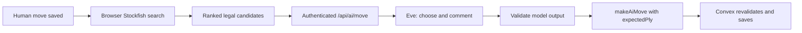

1. The saved game says it is the AI's turn.
2. [`use-ai-turn.ts`](src/hooks/use-ai-turn.ts) orchestrates a browser engine search.
3. Candidate data goes to `/api/ai/move`.
4. The route authenticates the user and reads the game with the caller's Convex token.
5. Position, history, difficulty, and saved Eve session come from the server's game document. Candidate moves are checked against that position.
6. Eve receives the persona, history, candidates, and selection policy.
7. The model returns structured output: a move and commentary of up to 400 characters.
8. The result is validated and submitted through `makeAiMove`.
9. The reactive game update moves the pieces; commentary appears in the sidebar.

The Eve session id is saved on the game for continuity across turns. The agent disables its default general-purpose tools and exposes the project's chess-specific tool. `analyse_position` packages supplied engine context; there is no separate server-side Stockfish process hidden inside Eve.

### Part 6 — Fall back without leaving the game stuck

The opponent path can degrade from **Eve → a direct AI SDK attempt → a legal engine candidate**. The Eve and direct-model phases share a **10-second deadline**. The browser has an additional **15-second request timeout** and engine fallback handling.

The move route's fallback uses the first legal candidate. Other engine-only client paths apply their own difficulty logic. This distinction matters when explaining why an occasional fallback may play differently from the persona's usual selection policy.

**Opponent commentary is not token-streamed.** The route sends newline-delimited JSON status heartbeats, followed by a complete result. The interface can show progress while the explanation arrives as one piece. The tutor uses a different streaming protocol.

---

## 🎓 The Visual Tutor

### Part 1 — A separate model and purpose

The tutor is an assistant for the person looking at the board. It works in games the member can access: their AI/local games, online games, spectating, and replay.

It uses the configured **`anthropic/claude-sonnet-5`** model through AI Gateway. The model id lives in [`src/lib/tutor/model.ts`](src/lib/tutor/model.ts). A fallback-id constant exists there, but the tutor route does **not** currently implement automatic model failover.

### Part 2 — The server reconstructs the position

A tutor request contains:

```ts
{
  gameId,
  ply,       // the position currently being viewed
  messages,  // the conversation
}
```

It does not accept an authoritative FEN. The server reads the game with the caller's token, validates `ply`, and replays the saved moves up to that point. The resulting position and game context are included in the system prompt.

This makes **“explain this position”** mean the board the user is reviewing, including when that board is several moves behind the live game.

### Part 3 — Four tools connect the explanation to the board

| Tool | Where it executes | What it does |
| --- | --- | --- |
| `requestAnalysis` | Browser | Runs Stockfish for the position in view and returns candidate lines, or a busy/unavailable result |
| `highlightSquares` | Server acknowledges validated input; browser renders it | Marks up to 16 squares using a named tone |
| `drawArrows` | Server acknowledges validated input; browser renders it | Draws up to 6 arrows between valid board squares |
| `showLine` | Server validates; browser renders the accepted result | Replays up to 12 SAN moves from the request's position and returns a numbered line |

The analysis tool has **no `execute` function** in the shared tool definition. The browser handles the call in `useChat`'s `onToolCall`, then returns data with `addToolOutput`. The model can use that result in its continuation.

The tutor asks for analysis before judging a move or claiming an evaluation. If the opponent is already using the engine, the browser can return **`engine-busy`**. The tutor should explain that limitation instead of pretending it has calculated fresh lines.

### Part 4 — Drawing is structured data

The model does not generate CSS, SVG markup, or Three.js code. It produces validated tool inputs:

```ts
// Example drawing request
{
  arrows: [
    { from: "f6", to: "e4", tone: "threat" }
  ]
}
```

Squares must match `[a-h][1-8]`, and tones must be one of **`good`**, **`bad`**, **`threat`**, or **`idea`**. A `showLine` call is replayed through chess.js; an illegal continuation returns a reason and how far the line was legal.

The 2D board turns the annotation data into an SVG overlay. The 3D board renders geometry above the board surface. Neither layer intercepts a player's normal square clicks. Numbered line arrows and labelled chips give the drawings meaning beyond colour alone.

### Part 5 — The full request lifecycle

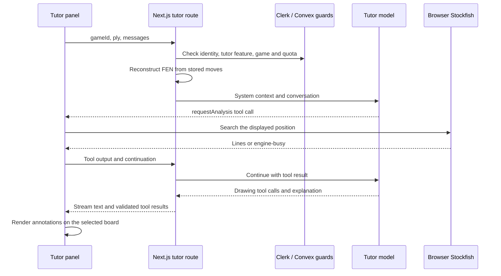

The route uses AI SDK 7's `streamText`, UI-message validation, and a **six-step stop condition**, with `maxDuration = 60`. Browser-tool continuations return through the chat transport; this is an interactive tool loop rather than one uninterrupted server-only function.

### Part 6 — Quotas and conversation lifetime

- `tutorTurnsUsed` is stored on the **game**, capped at **40**. It is shared across callers of that game, not 40 per subscriber.
- The guard charges before the model call. A later model failure still consumes a turn.
- The route does not charge when it detects that no usable gateway credential is available.
- Tool-result continuations also pass through the route guard, so a visible question is not guaranteed to equal exactly one quota increment.
- There are request-shape and size limits, and at most 80 incoming messages.
- The tutor conversation is held in client state; there is no durable tutor transcript table. Do not rely on it surviving a refresh.
- Accepted drawings can be toggled through chips and cleared explicitly. Their relationship to the original position is tracked so stale arrows do not silently describe different pieces.

These details are implemented in [`guard.ts`](src/lib/tutor/guard.ts), [`use-tutor-chat.ts`](src/hooks/use-tutor-chat.ts), and [`position-context.ts`](src/lib/tutor/position-context.ts).

---

## 🔐 Clerk Authentication and Billing

### Identity: one player, one verified account

[**Clerk**](https://go.clerk.com/sonny) handles the sign-up/sign-in UI and sessions. Castle requires a username, which becomes the profile handle, and reads the avatar from Clerk.

The integration has two paths:

1. **Browser → Convex:** `ClerkProvider` wraps `ConvexProviderWithClerk`, which uses Clerk's auth hook to supply tokens to Convex.
2. **Next.js server → Convex:** [`getAuthToken()`](src/lib/convex-server.ts) requests the JWT template named `convex` and passes that token to server-side queries and mutations.

Convex validates the token against `CLERK_JWT_ISSUER_DOMAIN` with audience `convex`. Its authorization helpers resolve the player through `identity.tokenIdentifier`. A client cannot act as another player by supplying someone else's id to those helpers.

The provider setup follows the [official Convex and Clerk integration guide](https://docs.convex.dev/auth/clerk). This checkout explicitly requests the `convex` JWT template on the server, so keep the named template and client integration consistent.

### Route protection happens in layers

| Boundary | Check |
| --- | --- |
| [`src/proxy.ts`](src/proxy.ts) | Clerk protection for `/play`, `/game`, `/settings`, and `/profile` |
| Protected layout | An additional server-side `auth.protect()` |
| AI route handlers | Explicit `auth()` checks with JSON errors |
| Convex functions | Verified identity, player record, and action-specific access checks |

The AI API handlers check auth themselves so callers get meaningful errors such as `401 unauthorized`, rather than relying on a page redirect.

### Billing: one user-level plan and one feature

| Plan | Payment | Access |
| --- | --- | --- |
| `free_user` | Free plan | Core play modes, AI opponents, rooms, profiles, and ratings |
| `pro` | Monthly price configured in Clerk | Everything above plus the **`tutor`** feature |

This is **individual user billing**. There is no organization or seat-based billing model in Castle.

The app checks the feature, not a hard-coded plan id:

```ts
// Simplified server-side entitlement check from the tutor guard
const { userId, has } = await auth();

if (userId === null) {
  return Response.json({ error: "unauthorized" }, { status: 401 });
}

if (!has({ feature: "tutor" })) {
  return Response.json({ error: "pro-required" }, { status: 402 });
}
```

The client uses the same feature slug for the locked/unlocked panel. That client check controls presentation; the **server check protects the paid model call**.

The price comes from Clerk's `<PricingTable />`, and the subscription is managed through Clerk's profile interface. After checkout, `/pro?welcome=1` reloads the session once so feature claims can refresh, then offers a way back to the game.

### Why the quota is in Convex but the billing gate is in Next.js

This build uses a custom Convex JWT. Its Convex functions do not use Clerk subscription feature claims, so they cannot serve as the `tutor` entitlement authority. The Next.js route checks Clerk before requesting the model; Convex enforces game access and the shared usage counter.

A quota mutation is consequently a **usage/access guard**, not proof of a paid subscription. An authorized game viewer can call that mutation without proving Pro to Convex. Keep that distinction in mind if extending this into billing-grade metering or stronger abuse prevention.

---

## 🌐 Matchmaking, Presence, and Ratings

### Matchmaking: widen the search as somebody waits

`queue.join` checks that the player has no active game and is not already queued. It records their **human-opponent rating**, then schedules a pairing attempt. An additional cron runs every five seconds.

The rating range is:

```ts
range = 200 + Math.floor(waitMilliseconds / 10_000) * 100;
```

| Wait | Range for that queue entry |
| --- | --- |
| 0–9 seconds | ±200 |
| 10–19 seconds | ±300 |
| 20–29 seconds | ±400 |
| 30–39 seconds | ±500 |

The pairing pass considers older entries first. It compares the rating difference with the **larger** of the two players' current ranges, randomly assigns colours, creates the game, removes both queue entries, and seeds presence in one mutation. Queue entries older than 15 minutes are removed.

Keeping queue scans in the internal pairing mutation gives the user-facing join/leave operations small read sets. Indexed active-game lookups help enforce **one active game per player**.

### Presence: keep heartbeats away from the game document

Each viewer sends a heartbeat roughly every **15 seconds**. Presence is stored separately from the game, so a heartbeat does not require rewriting the game document watched by the board.

| Scheduled job | Interval | Purpose |
| --- | --- | --- |
| Pair queued players | 5 seconds | Match players and widen eligibility over time |
| Sweep abandoned games | 20 seconds | Finalize eligible disconnected or stale games |
| Refresh spectator counts | 20 seconds | Update denormalized counts separately |
| Garbage-collect presence | 5 minutes | Remove old presence rows |

An online participant becomes stale after **60 seconds** without presence. If one side remains, the stale side can forfeit; if both are stale, the game becomes a draw without rating changes. Enforcement happens on the sweep, so it is not a precision 60-second chess clock. AI/local games use a separate **24-hour inactivity** cleanup and are finalized unrated.

### Elo: save the rating with the result

Every player starts at **1,200**. Castle stores an overall rating plus separate human and AI pools.

```text
Expected score = 1 / (1 + 10 ^ ((opponentRating - yourRating) / 400))
Rating delta   = round(K × (actualScore - expectedScore))
```

`actualScore` is **1** for a win, **0.5** for a draw, or **0** for a loss. `K` is **32** for online games and **16** for AI games. Ratings have a floor of **100**.

For equal-rated online opponents, the winner gains 16 and the loser loses 16 before any floor adjustment. AI results use the fixed rating configured for the selected difficulty.

The terminal result, eligible player ratings, and rating-history records are written transactionally. Local games and games made unrated by a take-back do not update Elo. See [`convex/lib/games.ts`](convex/lib/games.ts) and [`convex/lib/elo.ts`](convex/lib/elo.ts).

---

## 🎨 3D Rendering and Shared State

### One controller, two renderers

Both boards consume the same `BoardViewProps` contract in [`src/lib/types.ts`](src/lib/types.ts). The controller owns interaction and review state; the renderer translates that into visuals.

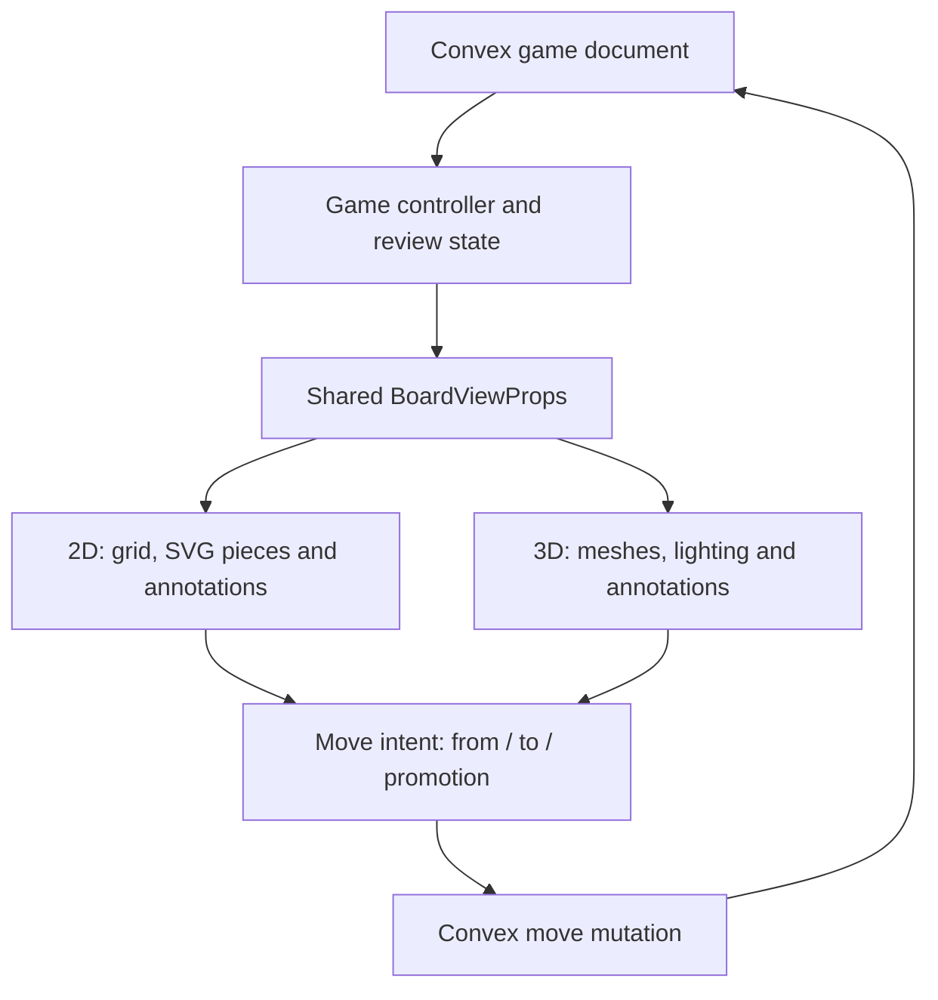

Switching views does not start a second game or duplicate its rules. Selected squares, the position being reviewed, and annotation data can travel through the same interface.

### How a chess square becomes a 3D location

The board is centered on the origin, with one square equal to one world unit. The Y axis points up. White sits on the positive Z side.

```ts
// fileIndex and rankIndex are 0–7
x = fileIndex - 3.5;
y = 0;
z = 3.5 - rankIndex;
```

So `a1` maps to `[-3.5, 0, 3.5]` and `h8` to `[3.5, 0, -3.5]`. Selection, move destinations, and tutor arrows use the same coordinate conventions.

### Room atmosphere is more than a background image

Room presets define board/piece colours, lighting, environment references, and camera presentation. The latest room update adds a generated library panorama for Classic Study, an 8K photographic panorama for Park, procedural nebula/stars for Space, a geometric illuminated pavilion for Neon Arcade, and a continuous geometric sweep for Minimal White. The Study image is 1774 × 887; it is not a 4K asset. HDR environments provide light/reflections; photographic backdrops and procedural scenery provide the surrounding atmosphere. The 2D board also receives room styling.

The GLB contains the six piece types. The rendering layer positions and animates their instances according to the game state. Piece tracking helps keep animations attached to the correct piece through moves and captures.

### Quality settings and graceful degradation

High, Medium, and Low tiers tune render resolution and effects. The post-processing pipeline can include ambient occlusion, outlines, bloom, antialiasing, vignette, and tone mapping. Effects vary by tier and the user's settings.

A performance monitor can step quality down when sustained performance declines; the watchdog prevents another drop for eight seconds. Missing WebGL support offers a 2D path. Reduced-motion preferences limit camera and UI animation.

### Store the right state in the right place

| State | Home |
| --- | --- |
| Position, moves, result, rating, presence, saved preferences | Convex |
| Identity and subscription feature | Clerk |
| Board mode, camera/quality preferences, layout controls | UI Zustand store, with applicable preferences synced to Convex |
| Engine status, download progress, turn phase, hints | AI Zustand store |
| Tutor drawings and their position context | Tutor Zustand store |
| Tutor conversation and in-flight chat state | React / AI SDK client state |
| Player-to-player messages | Convex Agent component, linked from the game |

This keeps transient rendering changes out of game transactions while allowing saved preferences to follow the player.

---

## 🗃️ Database and Routes

### The six application tables

| Table | Stores | Why it exists separately |
| --- | --- | --- |
| `players` | Clerk identity link, username, avatar, three ratings, records, room/board settings | Player identity and preferences span games |
| `queue` | Player, rating snapshot, join time | Matchmaking has its own indexed work queue |
| `games` | Seats, mode, difficulty, FEN, SAN moves, PGN, status, usage counts, Eve session, player-chat thread id | Authoritative record for one game |
| `presence` | Game, player, role, last-seen time | Frequent heartbeats should not rewrite game state |
| `commentary` | AI explanation, game, ply, source and persona | Opponent commentary is associated with a specific move |
| `ratingHistory` | Player, game, pool, before/after rating, delta | Supports history charts and result records |

The Convex Agent component maintains its own message/thread storage. Uploaded room images use Convex file storage. The full schema and indexes are in [`convex/schema.ts`](convex/schema.ts).

### Route map

| Route | Access | Purpose |
| --- | --- | --- |
| `/` | Public | Landing page, historical-game replay, rooms, activity |
| `/leaderboard` | Public | Rating leaderboard |
| `/pro` | Public | Tutor explanation and Clerk pricing table |
| `/sign-in`, `/sign-up` | Public | Clerk's embedded authentication screens |
| `/play` | Signed in | Game setup, matchmaking, recent/live games |
| `/game/[id]` | Signed in, game-specific access | Play, spectate, or replay |
| `/profile/[username]` | Signed in | Player record and rating history |
| `/settings` | Signed in | Room, board, graphics, account and credits |
| `/api/ai/move`, `/api/ai/hint` | Authenticated participant of an eligible AI game | AI move and hint orchestration |
| `/api/tutor` | Authenticated, `tutor` feature, game access and quota | Tutor conversation and tools |
| `/eve/v1/*` | Eve channel authorization | Same-origin opponent agent service |
| `/dev/game`, `/dev/pages`, `/dev/board3d`, `/dev/ui-kit` | Development only | UI and rendering previews; unavailable in production |

---

## 🏁 Getting Started

### Prerequisites

- **Node.js 24 or newer**.
- **pnpm 11.24.0**, matching `packageManager` in `package.json`.
- A **[Clerk account](https://go.clerk.com/sonny)** and a **[Convex account](https://www.convex.dev/)**.
- AI Gateway access for the language-model features.
- A browser with WebAssembly; WebGL2 enables the 3D experience.

### 1. Download the repository and install

Clone the public repository and open its root:

```bash
git clone https://github.com/sonnysangha/Castle-3d-multiplayer-with-ai-vercel-eve-nextjs-clerk.git
cd Castle-3d-multiplayer-with-ai-vercel-eve-nextjs-clerk
pnpm install
cp .env.example .env.local
```

Only copy `.env.example` on first setup; preserve an existing `.env.local`. Engine assets are already checked in, so the manual copy script is only needed when refreshing them:

```bash
pnpm copy:stockfish
```

### 2. Create your Clerk application

Start at **[go.clerk.com/sonny](https://go.clerk.com/sonny)** and create your own development application.

In the Clerk Dashboard:

1. Enable your desired email sign-in methods.
2. Enable Google and GitHub if you want the demo's social sign-in choices.
3. Enable usernames and require a username at sign-up. Profiles depend on them.
4. Copy the publishable key and secret key into `.env.local`.
5. Keep the app's embedded sign-in/sign-up routes configured as below.

```dotenv
NEXT_PUBLIC_CLERK_PUBLISHABLE_KEY=<your-clerk-publishable-key>
CLERK_SECRET_KEY=<your-clerk-secret-key>
NEXT_PUBLIC_CLERK_SIGN_IN_URL=/sign-in
NEXT_PUBLIC_CLERK_SIGN_UP_URL=/sign-up
NEXT_PUBLIC_CLERK_SIGN_IN_FALLBACK_REDIRECT_URL=/play
NEXT_PUBLIC_CLERK_SIGN_UP_FALLBACK_REDIRECT_URL=/play
```

Alternatively, after linking the Clerk CLI to **your own application**, `clerk env pull` can populate its keys. Dashboard steps are sufficient; the CLI is optional.

### 3. Configure the Clerk token used by this checkout

Activate the Convex integration in Clerk and verify that the **JWT template named `convex`** required by this source is available. If configuring the template manually, use the Convex preset and ensure its claims include:

```json
{
  "aud": "convex",
  "nickname": "{{user.username}}",
  "picture": "{{user.image_url}}"
}
```

Keep the preset's standard identity claims. The audience must match `applicationID: "convex"` in `convex/auth.config.ts`, and `nickname` must carry the username.

Copy your Clerk **Frontend API / issuer URL**. You will set that on Convex, not in the browser. See the [official integration guide](https://docs.convex.dev/auth/clerk) alongside this checkout's [`getAuthToken`](src/lib/convex-server.ts) implementation.

### 4. Create and configure your Convex deployment

```bash
pnpm exec convex dev
```

Follow the CLI prompts to create or select **your** project. It writes deployment information into `.env.local` and syncs the schema, functions, component registration, and cron jobs.

Set the Clerk issuer on that Convex deployment, from another terminal:

```bash
pnpm exec convex env set CLERK_JWT_ISSUER_DOMAIN https://YOUR-INSTANCE.clerk.accounts.dev
```

Replace the example domain with the issuer from your application. If the first function push reports the missing variable, set it and let `convex dev` sync again.

Leave the Convex development process running while working. The app creates a player record after authentication; there is no general database seed step required before the first game. `convex/seedPlayers.ts` and `convex/seedProfile.ts` are operator-only demo fixtures restricted to the original development deployment. They create fictional leaderboard/profile records and are not required or portable setup commands. Demo ratings and activity can therefore include seeded data.

### 5. Configure AI Gateway

For local development outside an OIDC-enabled Vercel environment, put your AI Gateway key in `.env.local`:

```dotenv
AI_GATEWAY_API_KEY=<your-ai-gateway-api-key>
```

If you already linked your own Vercel project, an alternative is:

```bash
vercel env pull .env.local
```

Preserve locally added settings when pulling environment files. Locally pulled OIDC tokens expire, so refresh them when necessary. On Vercel, the integration can use the runtime's OIDC credentials. The [AI Gateway authentication documentation](https://vercel.com/docs/ai-gateway/authentication-and-byok) explains the API-key and OIDC options.

The configured models are:

| Purpose | Model id | Source |
| --- | --- | --- |
| Opponent / direct opponent fallback | `anthropic/claude-haiku-4.5` | `agent/agent.ts`, `src/app/api/ai/_lib/eve-agent.ts` |
| Tutor | `anthropic/claude-sonnet-5` | `src/lib/tutor/model.ts` |

Confirm access to those model ids in your gateway account. Changing a model is a code/configuration change; it does not require exposing a provider credential to the browser.

### 6. Set the Eve server secret

Generate a strong random value with your password manager or local secret-generation tool and store it as:

```dotenv
EVE_SERVER_SECRET=<a-strong-random-server-secret>
```

This authenticates the server-to-server path between `/api/ai/*` and the Eve channel. Use the same value wherever those two sides run. The default same-origin deployment resolves the agent host automatically; `EVE_HOST` is an optional override.

Restart the development server after adding or rotating this secret. **A working AI move alone does not prove Eve is configured**: the route can fall back to a direct model call or engine move. Inspect the result's `source` and agent logs when verifying the Eve path.

### 7. Configure Castle Pro in Clerk

In your Clerk **development** application:

1. Enable **Billing for users**.
2. Use the development/test payment gateway.
3. Create a public, monthly **Pro** plan with slug **`pro`**.
4. Create the feature **`tutor`** and attach it to that plan.
5. Choose the price in Clerk. The page will read it through `<PricingTable />`.
6. Confirm that the free user plan is available.
7. Visit `/pro` and verify the plan renders.

The project needs no separate Stripe SDK, mirrored `isPro` field, or subscription webhook to enforce this feature. Clerk remains the entitlement source.

You can run the core game without configuring Pro. The locked tutor will point to the subscription page until the feature is available.

### 8. Run the app

Use two terminals:

```bash
# Terminal 1 — database, functions and schema sync
pnpm convex
```

```bash
# Terminal 2 — Next.js with Eve mounted by withEve
pnpm dev
```

Open **[http://localhost:3000](http://localhost:3000)**, sign up, and create an AI or local game. `withEve` is already installed in `next.config.ts`; there is no third manual agent command required for the normal development path.

To try the tutor, subscribe through `/pro` using Clerk's **test checkout**. Use the test gateway's documented test details, then return to the game and ask a question. Do not use real payment details for a development checkout.

### Environment variable reference

| Variable | Location | Purpose |
| --- | --- | --- |
| `NEXT_PUBLIC_CLERK_PUBLISHABLE_KEY` | `.env.local` / frontend host | Clerk's browser configuration |
| `CLERK_SECRET_KEY` | `.env.local` / server host | Server-side Clerk access |
| Four `NEXT_PUBLIC_CLERK_*URL` variables above | `.env.local` / frontend host | Embedded auth routes and redirect destinations |
| `CONVEX_DEPLOYMENT` | Local CLI environment | Selects the Convex deployment |
| `NEXT_PUBLIC_CONVEX_URL` | `.env.local` / frontend host | Convex client endpoint |
| `NEXT_PUBLIC_CONVEX_SITE_URL` | CLI-managed local environment | May be written by Convex; current app code does not use it |
| `CLERK_JWT_ISSUER_DOMAIN` | **Convex deployment environment** | Clerk token issuer trusted by Convex |
| `AI_GATEWAY_API_KEY` | Local/server environment | Explicit gateway credential, alternative to OIDC |
| `VERCEL_OIDC_TOKEN` | Local/server runtime | OIDC gateway credential; local copies expire |
| `EVE_SERVER_SECRET` | Server and Eve environment | Shared secret for the agent channel |
| `EVE_HOST` | Optional server environment | Override the Eve origin |
| `CONVEX_DEPLOY_KEY` | Deployment/build environment | Allows the hosted build to deploy Convex |

Only the intentionally public variables use `NEXT_PUBLIC_`. Do not commit real credentials or authentication state. [`.env.example`](.env.example) is the names-only template.

### First-run checklist

- [ ] Node 24+ and the pinned pnpm version are installed.
- [ ] Dependencies installed and `.env.local` created.
- [ ] Clerk keys and all four auth-route variables are set.
- [ ] Usernames are required at sign-up.
- [ ] The `convex` token path, audience, and username claim match the source.
- [ ] Convex has the correct Clerk issuer and the latest functions/schema/component.
- [ ] Both development processes are running.
- [ ] A local game accepts moves and switches between 2D and 3D.
- [ ] An AI game downloads Stockfish and produces a legal reply.
- [ ] Eve's secret and the gateway credential are set; verify the response source.
- [ ] Optional Pro setup: the `tutor` feature unlocks after test checkout and the tutor answers.

---

## 🎬 Demo Walkthrough

A recording sequence that demonstrates the mechanics as well as the visuals:

1. **Start on the landing page.** The board replays Morphy's 1858 Opera Game. Change rooms and show that the environment is interactive.
2. **Sign up with Clerk.** Show the embedded flow and required username, then arrive at Play.
3. **Pick Marco or Pip.** Select a colour, start the game, and show the engine download/progress on a fresh browser.
4. **Play a few moves.** Show the opponent's reply and commentary. Explain that Stockfish supplies candidates and the model chooses and comments.
5. **Switch to 2D and back.** The position and history remain the same because both renderers consume the same game state.
6. **Ask for a hint, then take back a move.** Beginner/Casual have three hints; taking back makes an AI game unrated.
7. **Demonstrate multiplayer with two accounts.** Queue in two isolated browser sessions, make a move in each, and show the reactive updates. Send a consensual demo message between those two accounts and show a draw offer.
8. **Use a third account to spectate.** Show the public online board and spectator count. Player chat should remain unavailable to that spectator.
9. **Open Castle Pro.** Explain that Clerk owns the plan and `tutor` feature. Complete a test checkout with a demo account.
10. **Ask the tutor about the position.** Try “Show me the threats,” then “Why does that move work?” Show its drawing tools, annotation chips, and the same annotations in 2D.
11. **Rewind the board.** Ask about the earlier position, show its move label, and compare it with the live position.
12. **Finish and review.** Open the profile/leaderboard, explain rated versus unrated results, and export the PGN.

Use real accounts and live requests to demonstrate integration behavior. The `/dev/*` previews are useful for controlled screenshots and UI inspection, but their scripted responses do not prove authentication, billing, multiplayer, or model calls.

---

## 🧪 Testing and Verification

### Unit and backend checks

```bash
pnpm typecheck
pnpm lint
pnpm test
pnpm build
```

Vitest covers shared chess helpers, difficulty policies, engine parsing/lifecycle, camera geometry, tutor tools/guards, UI helpers, and Convex behavior. Backend tests use `convex-test` for games, matchmaking, presence, players, leaderboards, ratings, tutor quota, and player chat.

Publication checks include TypeScript, ESLint, and Vitest. A production build and full authenticated browser suite are separate verification steps; no deployment is implied by publishing this repository.

### Playwright

Install the browser once:

```bash
pnpm exec playwright install chromium
```

| Command | Current behavior |
| --- | --- |
| `pnpm e2e` | Runs `public.spec.ts`, `pro.spec.ts`, and `tutor.spec.ts`; authenticated portions skip without test credentials |
| `pnpm e2e:auth` | Runs all Playwright specs, including authenticated flows and player-chat UI tests |
| `pnpm exec playwright test e2e/player-chat.spec.ts` | Runs the dedicated development-preview player-chat UI checks |
| `pnpm exec playwright show-report` | Opens the latest HTML report |

The configuration starts/reuses a local development server unless `E2E_BASE_URL` is supplied. Development-preview tests need a local development server because those routes are absent from production builds.

Use a **throwaway Clerk development user** for authenticated tests. Those tests create and finish games, and the Pro flow may create a test subscription.

| Test variable | Purpose |
| --- | --- |
| `E2E_BASE_URL` | Optional existing server URL; empty/unset uses localhost and server management |
| `E2E_CLERK_USER_EMAIL` | Preferred test identity; the suite can mint a sign-in ticket |
| `E2E_CLERK_USER_USERNAME` | Fallback identifier for password sign-in |
| `E2E_CLERK_USER_PASSWORD` | Password for the fallback strategy |

The suite loads `.env.local` and `.env`. Clerk testing-token setup is only enabled when test-user configuration is present. Use a development instance for Clerk's testing-token flow; production credentials are not appropriate for it.

### Development previews

| URL | What to inspect |
| --- | --- |
| `/dev/game?scenario=ai-midgame` | Game shell, AI progress and commentary |
| `/dev/game?scenario=online-draw-offer` | Draw state and player-chat controls |
| `/dev/game?scenario=tutor-pro` | Scripted tutor conversation, drawing chips, and annotations |
| `/dev/game?scenario=tutor-locked` | Free-user tutor prompt |
| `/dev/game?scenario=tutor-quota` | Quota-exhausted UI |
| `/dev/pages?section=play` | Setup components and lobby states |
| `/dev/pages?section=settings` | Room/graphics preferences and preview |
| `/dev/pages?section=profile` | Sample history and results |
| `/dev/pages?section=leaderboard` | Sample ratings and empty state |
| `/dev/board3d` | 3D rendering inspection |
| `/dev/ui-kit` | UI primitives and design states |

These routes use the application's presentation components with controlled sample data. Their production guard returns a not-found response.

---

## 🚀 Deployment

### 1. Create your own service resources

Use your own Vercel project, Convex production deployment, and Clerk production instance. The repository's linked local service folders are not a portable deployment configuration.

The existing [production notes](docs/KNOWN_ISSUES.md) document development Clerk credentials in the demo setup. A real launch needs production auth configuration, your domain, and production OAuth applications.

### 2. Configure production authentication and billing

- Set the production Clerk publishable/secret keys and the four auth-route URLs on Vercel.
- Configure the domain and production social-provider credentials in Clerk.
- Recreate or verify the `convex` JWT template/integration on the production instance.
- Set the matching issuer on the **Convex production deployment**.
- Recreate/verify the production user billing plan and `tutor` feature before accepting real subscriptions.

Development application configuration does not by itself prove production is configured correctly.

### 3. Deploy Convex with the frontend build

Set `CONVEX_DEPLOY_KEY` for the intended production deployment and use this Vercel Build Command:

```bash
npx convex deploy --cmd 'pnpm build'
```

This is the project's documented deployment path. It keeps the Convex schema/functions/component and the frontend that calls them in the same release workflow. A frontend-only release can otherwise call a function absent from the deployed backend.

Set the matching Convex URL, Eve secret, and gateway authentication on the hosted project. Enable/configure Vercel Fluid compute for the Eve service and verify the deployed function durations accommodate the **30-second opponent route** and **60-second tutor route**.

### 4. Preserve the existing deployment workaround

The project documents an interaction between **Eve's `withEve` integration and Next.js 16.3 segment prefetching** on Vercel. `next/link` instances intentionally use **`prefetch={false}`** to avoid that issue.

Do not remove that workaround merely because local development looks fine. Check [`docs/KNOWN_ISSUES.md`](docs/KNOWN_ISSUES.md) and test navigation on the deployed build before changing it.

### 5. Verify the deployed integration

Check sign-up, player provisioning, a local game, an AI game, two-account matchmaking, spectator access, a test subscription in the appropriate test environment, tutor drawings, and sign-out. Inspect the actual AI source so engine fallback is not mistaken for a working Eve connection.

Verify application-specific content and access boundaries on the hosted URL. `/dev/*` pages should be unavailable there. Review product/legal requirements separately before treating an educational demo as a public commercial service.

---

## 🐛 Troubleshooting

| Symptom | What to check |
| --- | --- |
| Sign-in goes to Clerk's hosted portal | Set all four auth-route variables, especially `NEXT_PUBLIC_CLERK_SIGN_IN_URL=/sign-in`, and restart |
| Clerk is signed in but Convex says unauthenticated | Verify token audience, `convex` template, matching issuer, and the Clerk/Convex provider setup |
| Profile has no usable username | Require usernames in Clerk and map `nickname` to `{{user.username}}` in the Convex token |
| “Player not provisioned” | Allow the authenticated player-sync step to finish; check Convex connectivity and `players.ensurePlayer` |
| “Already in game” when starting another | Resume, finish, or resign the active game; one active game per account is intentional |
| No online opponent appears | Use two different signed-in users and check queue pairing; one account cannot match itself |
| AI moves work but no Eve traces appear | Verify `EVE_SERVER_SECRET` and inspect result `source`; a fallback can still make legal moves |
| AI Gateway fails locally after working yesterday | A locally pulled OIDC token may have expired; refresh it or configure an explicit gateway key |
| Stockfish hangs or WASM returns 404 | Verify the committed worker/WASM sibling files and use `pnpm copy:stockfish` if refreshing assets |
| Browser shows SF11 | The SIMD capability probe selected the compatibility build |
| AI move rejected as `stale-ai-move` | The saved ply changed while the result was in flight; the stale result must not be replayed |
| Tutor answers `402 pro-required` | The server cannot see Clerk's `tutor` feature; check plan attachment and refresh the session after checkout |
| Pro checkout succeeded but tutor remains locked | Let `/pro?welcome=1` reload the session; verify the exact feature slug and environment |
| Tutor answers `503 tutor-unavailable` | Check gateway credential availability/expiry and that the deployed Convex backend includes the quota function |
| Tutor returns `429 quota` earlier than expected | The counter is shared per game and the guard also runs on tool continuations; inspect `tutorTurnsUsed` |
| Tutor says the engine is busy | Opponent search has priority; the tutor can explain without a new analysis result |
| An old tutor drawing disappears | Its originating history or relevant pieces changed; stale drawings are cleared intentionally |
| Spectator cannot see player chat | Player chat is restricted to the two online participants |
| Ratings did not change | Check local mode, take-backs, and unrated abandonment outcomes |
| Navigation repeatedly requests segment trees after deployment | Check the existing `withEve` prefetch workaround and `prefetch={false}` links |
| Authenticated Playwright tests skip | Configure a throwaway development test user via email or username/password |
| Password-based test login needs client trust | Prefer the test-user email/ticket path supported by the suite |
| Development preview returns 404 on a deployed build | Expected: previews are development-only |

---

## 🏆 Take It Further

These are extension ideas, not existing feature claims:

- **Chess clocks:** server-owned time controls, increments, and timeout results.
- **Competitive integrity:** move provenance, server-owned analysis where required, and abuse controls before treating ratings as competition-grade.
- **A refined tutor allowance:** meter logical questions per member, separate them from tool continuations, and use a deliberate retry/refund policy.
- **Saved tutoring sessions:** durable transcripts with explicit retention rules and position links.
- **Tutor evaluation:** curated positions to test tactical explanations, line legality, annotation usefulness, and model behavior when the engine is unavailable.
- **Post-game review:** classify mistakes and turning points across the whole game.
- **Puzzles and lessons:** reuse the board/controller contract for constrained training positions.
- **Tournaments and clubs:** add scheduling, brackets, membership, and invitations.
- **Chat moderation and reporting:** extend the current participant-only chat with controls suitable for a wider audience.
- **Rendering experiments:** additional piece sets, rooms, and measured quality/performance tradeoffs.

---

## 📋 Quick Reference

### Commands

| Command | Purpose |
| --- | --- |
| `pnpm install` | Install the repository's dependencies |
| `pnpm dev` | Start Next.js and the integrated Eve development path |
| `pnpm convex` | Run Convex development synchronization |
| `pnpm build` | Build the production application |
| `pnpm start` | Serve a production build |
| `pnpm typecheck` | TypeScript checking |
| `pnpm lint` | ESLint |
| `pnpm test` | Vitest unit/component/backend tests |
| `pnpm e2e` | Selected public, Pro, and tutor Playwright specs |
| `pnpm e2e:auth` | All Playwright specs, with authenticated tests when configured |
| `pnpm copy:stockfish` | Refresh committed engine files from installed Stockfish packages |

### Key files

| File | Responsibility |
| --- | --- |
| [`src/proxy.ts`](src/proxy.ts) | Clerk route protection |
| [`src/components/providers/convex-client-provider.tsx`](src/components/providers/convex-client-provider.tsx) | Browser Clerk-to-Convex integration |
| [`src/lib/convex-server.ts`](src/lib/convex-server.ts) | Auth token for server-side Convex calls |
| [`convex/auth.config.ts`](convex/auth.config.ts) | Trusted Clerk issuer and audience |
| [`convex/schema.ts`](convex/schema.ts) | Application tables and indexes |
| [`convex/games.ts`](convex/games.ts) | Moves, game lifecycle, presence, hints and tutor quota |
| [`convex/queue.ts`](convex/queue.ts) | Queue membership and pairing |
| [`convex/lib/games.ts`](convex/lib/games.ts) | Shared game helpers and finalization |
| [`convex/playerChat.ts`](convex/playerChat.ts) | Participant-only human messages |
| [`convex/convex.config.ts`](convex/convex.config.ts) | Convex Agent component registration |
| [`convex/crons.ts`](convex/crons.ts) | Pairing, abandonment, spectators and presence cleanup |
| [`src/hooks/use-game-controller.ts`](src/hooks/use-game-controller.ts) | Shared game interaction controller |
| [`src/hooks/use-ai-turn.ts`](src/hooks/use-ai-turn.ts) | Engine and model orchestration for an AI turn |
| [`src/lib/engine/stockfish-client.ts`](src/lib/engine/stockfish-client.ts) | Worker lifecycle and engine protocol |
| [`src/lib/difficulty.ts`](src/lib/difficulty.ts) | Strength, selection policies and personas |
| [`src/app/api/ai/move/route.ts`](src/app/api/ai/move/route.ts) | Authenticated opponent route and fallbacks |
| [`agent/agent.ts`](agent/agent.ts) | Eve model, limits and capabilities |
| [`agent/channels/eve.ts`](agent/channels/eve.ts) | Agent channel and server authorization |
| [`agent/instructions.md`](agent/instructions.md) | Persona and move-choice instructions |
| [`src/app/api/tutor/route.ts`](src/app/api/tutor/route.ts) | Tutor model stream and tool loop |
| [`src/lib/tutor/guard.ts`](src/lib/tutor/guard.ts) | Entitlement, request, position and quota guards |
| [`src/lib/tutor/tools.ts`](src/lib/tutor/tools.ts) | Analysis and drawing contracts |
| [`src/hooks/use-tutor-chat.ts`](src/hooks/use-tutor-chat.ts) | Browser analysis tool and conversation transport |
| [`src/lib/tutor/position-context.ts`](src/lib/tutor/position-context.ts) | Position-aware suggestions and drawing invalidation |
| [`src/components/board2d/`](src/components/board2d) | 2D renderer |
| [`src/components/board3d/`](src/components/board3d) | Three.js board, pieces, scenery, camera and effects |
| [`src/lib/rooms.ts`](src/lib/rooms.ts) | Room definitions |
| [`src/lib/camera.ts`](src/lib/camera.ts) | Camera geometry and quality configurations |
| [`src/lib/types.ts`](src/lib/types.ts) | Shared application and board contracts |
| [`next.config.ts`](next.config.ts) | React Compiler, asset headers, and `withEve` |
| [`playwright.config.ts`](playwright.config.ts) | Browser-test setup and environment handling |

### More project documentation

- [Architecture and contracts](docs/ARCHITECTURE.md)
- [Product requirements](docs/PRD.md)
- [Pro tutor implementation notes](docs/PRO_TUTOR.md)
- [Known issues and deployment workarounds](docs/KNOWN_ISSUES.md)
- [Version-specific research notes](docs/research)
- [Brand brief](docs/BRAND_BRIEF.md)
- [Product context](PRODUCT.md) and [design system](DESIGN.md)
- [Screenshot sources](docs/assets/README.md)

Some design/research notes describe earlier stages of the build. For implemented behavior, follow the current source and package scripts; in particular, player chat is now present even where an older brief lists it as out of scope.

### Concepts to remember

- **Identity comes from Clerk**, not a browser-supplied player id.
- **Saved positions come from Convex**, not a FEN supplied by the model.
- **chess.js validates; Stockfish searches; language models explain.**
- **The tutor is a feature entitlement**, checked server-side through Clerk.
- **2D and 3D render one shared game contract.**
- **Presence is separate from game state** to avoid unnecessary board updates.
- **A legal move is not proof of honest engine provenance.**
- **A model fallback can keep play working**, so inspect the response source when testing integrations.

---

## 📜 Licences and Attribution

Castle is an educational project. This README does not assign a new licence to the application's own source; check the repository's licence terms before redistribution. Dependencies and bundled assets retain their respective licences.

| Asset | Credit / licence | Details |
| --- | --- | --- |
| **3D chess pieces** | **Jarlan Perez via Poly Pizza — CC BY 3.0** | Models were merged, centered, scaled and had normals/materials adjusted; preserve attribution and modification notices in [`public/models/ATTRIBUTION.md`](public/models/ATTRIBUTION.md) |
| **HDR environments and photographic backdrops** | Poly Haven — CC0; the generated Study artwork is documented separately | Photographer/source notes are in [`public/backdrops/ATTRIBUTION.md`](public/backdrops/ATTRIBUTION.md) |
| **Stockfish 18 and Stockfish 11** | GPL v3 | Preserve the bundled licence files and notices in [`public/stockfish/`](public/stockfish); source is available from [nmrugg/stockfish.js](https://github.com/nmrugg/stockfish.js) for the corresponding versions |
| **Landing-page game** | Morphy vs Duke Karl & Count Isouard, Paris, 1858 | Historical Opera Game replay |

Piece credits are also visible inside Settings. Keep those credits when reusing the assets. Clerk, Convex, Vercel, Stockfish, Anthropic, and other third-party names identify the technologies used; they do not imply endorsement of Castle.

Signup links use the creator's campaign URL: **[Clerk → https://go.clerk.com/sonny](https://go.clerk.com/sonny)**.

**[Join the free AI Community →](https://www.papareact.com/ztoh-form)**
