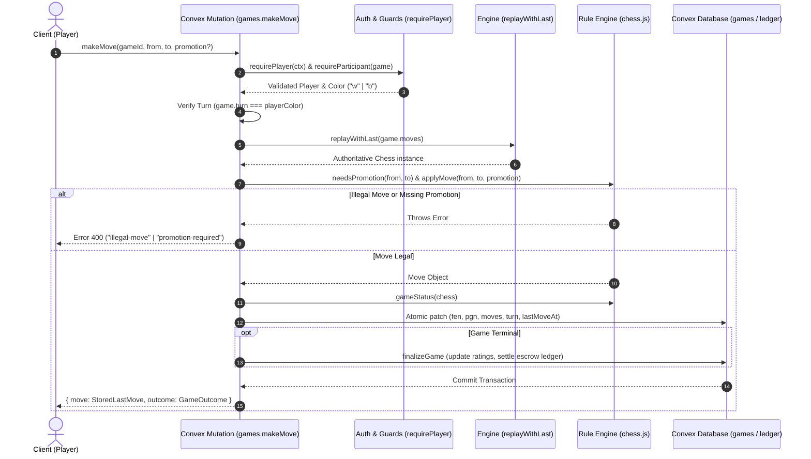

# Castle Chess — Chess Rules Specification

**Document Version:** 1.0  
**Audit Date:** 2026-09-26  
**Implementation Source:** `convex/lib/chess.ts`, `convex/games.ts`, `convex/lib/games.ts`, `src/lib/chess.ts`  
**Governing Standard:** FIDE Laws of Chess & Chess.js v1.4.0 Engine Integration

---

## 1. Architectural Philosophy & Invariants

Castle Chess implements server-authoritative chess enforcement under the following non-negotiable architectural invariants:

1. **Source of Truth is the SAN Move Sequence (`games.moves`):**
   - The platform never trusts a client-supplied FEN string.
   - Every state transition replays the game from the initial standard starting position using the SAN list (`replay(sans)` in [`convex/lib/chess.ts`](file:///c:/Users/USER/Downloads/Castle-3d-multiplayer-with-ai-vercel-eve-nextjs-clerk-main/Castle-3d-multiplayer-with-ai-vercel-eve-nextjs-clerk-main/convex/lib/chess.ts#L51-L61)).
   - Storing only FEN destroys history and makes threefold repetition detection mathematically impossible. Replaying SAN preserves full move history, castling eligibility, en passant rights, and half-move counts.
2. **Runtime Isolation:**
   - Chess verification runs in the default Convex V8 isolate runtime without Node.js dependencies (`"use node"` is strictly avoided).
3. **Class Instance Boundary Flattening:**
   - Chess.js `Move` objects are class instances and cannot cross the Convex serialization boundary. All moves are flattened into plain object structures ([`StoredLastMove`](file:///c:/Users/USER/Downloads/Castle-3d-multiplayer-with-ai-vercel-eve-nextjs-clerk-main/Castle-3d-multiplayer-with-ai-vercel-eve-nextjs-clerk-main/convex/lib/chess.ts#L35-L44)) before database persistence.

---

## 2. Rule-by-Rule Implementation Reference

### 2.1 King Safety, Check, and Checkmate
- **FIDE Reference:** Articles 1.2, 1.4, 5.1.a
- **Implementation File:** [`convex/lib/chess.ts:121-127`](file:///c:/Users/USER/Downloads/Castle-3d-multiplayer-with-ai-vercel-eve-nextjs-clerk-main/Castle-3d-multiplayer-with-ai-vercel-eve-nextjs-clerk-main/convex/lib/chess.ts#L121-L127)
- **Specification:**
  - When the king is attacked by one or two enemy pieces, the player is in **check**.
  - Any move that leaves or puts the player's own king in check is illegal and rejected with error `"illegal-move"`.
  - If a player is in check and has no legal moves to escape, it is **checkmate**.
  - In [`gameStatus(chess)`](file:///c:/Users/USER/Downloads/Castle-3d-multiplayer-with-ai-vercel-eve-nextjs-clerk-main/Castle-3d-multiplayer-with-ai-vercel-eve-nextjs-clerk-main/convex/lib/chess.ts#L121), `chess.isCheckmate()` is evaluated first:
    ```typescript
    if (chess.isCheckmate()) {
      return {
        status: "checkmate",
        winner: chess.turn() === "w" ? "b" : "w",
        endReason: "checkmate",
      };
    }
    ```
  - Winner receives full match escrow payout and positive Elo rating adjustment.

### 2.2 Stalemate
- **FIDE Reference:** Article 5.2.a
- **Implementation File:** [`convex/lib/chess.ts:129-131`](file:///c:/Users/USER/Downloads/Castle-3d-multiplayer-with-ai-vercel-eve-nextjs-clerk-main/Castle-3d-multiplayer-with-ai-vercel-eve-nextjs-clerk-main/convex/lib/chess.ts#L129-L131)
- **Specification:**
  - If the player whose turn it is has no legal move and is NOT in check, the game is a **stalemate**.
  - Evaluated immediately after checkmate. Note that `chess.isDraw()` in chess.js 1.4.0 conflates stalemate with other draws, so `isStalemate()` is evaluated explicitly:
    ```typescript
    if (chess.isStalemate()) {
      return { status: "stalemate", winner: "draw", endReason: "stalemate" };
    }
    ```
  - Both players receive half-score rating updates and stake refunds (minus platform fees where applicable).

### 2.3 Castling (Kingside and Queenside)
- **FIDE Reference:** Article 3.8.b
- **Implementation File:** [`convex/lib/chess.ts:84-93`](file:///c:/Users/USER/Downloads/Castle-3d-multiplayer-with-ai-vercel-eve-nextjs-clerk-main/Castle-3d-multiplayer-with-ai-vercel-eve-nextjs-clerk-main/convex/lib/chess.ts#L84-L93)
- **Specification:**
  - King moves two squares towards the rook (`e1-g1`, `e1-c1` for White; `e8-g8`, `e8-c8` for Black), and the rook leaps over the king to the adjacent square (`f1`, `d1`, `f8`, `d8`).
  - **Prerequisites Enforced:**
    1. Neither the king nor the chosen rook has moved previously in the game (verified via SAN replay history).
    2. All squares between the king and rook are empty.
    3. The king is not currently in check.
    4. The king does not pass through or land on any square attacked by enemy pieces.
  - The 3D and 2D boards dual-animate the king and rook in synchronized sequence.

### 2.4 En Passant Capture
- **FIDE Reference:** Article 3.7.d
- **Implementation File:** [`convex/lib/chess.ts:153-156`](file:///c:/Users/USER/Downloads/Castle-3d-multiplayer-with-ai-vercel-eve-nextjs-clerk-main/Castle-3d-multiplayer-with-ai-vercel-eve-nextjs-clerk-main/convex/lib/chess.ts#L153-L156)
- **Specification:**
  - A pawn advancing two squares from its initial square may be captured by an opposing pawn on the adjacent file as if it had only moved one square.
  - Must be executed immediately on the turn following the double-step advance.
  - **Capture Animation Coordinate Calculation:**
    - Unlike standard captures where the captured piece sits on the destination square `to`, in en passant the captured pawn stands one rank behind the destination.
    - Castle Chess calculates this explicitly in [`toStoredLastMove`](file:///c:/Users/USER/Downloads/Castle-3d-multiplayer-with-ai-vercel-eve-nextjs-clerk-main/Castle-3d-multiplayer-with-ai-vercel-eve-nextjs-clerk-main/convex/lib/chess.ts#L145-L158):
      ```typescript
      if (move.isEnPassant()) {
        stored.capturedSquare = `${move.to[0]}${move.from[1]}`;
      }
      ```
    - The 3D piece animation engine lifts and clears the captured pawn from `capturedSquare` instead of `to`.

### 2.5 Pawn Promotion & Underpromotion
- **FIDE Reference:** Article 3.7.e
- **Implementation Files:**
  - Backend: [`convex/lib/chess.ts:108-115`](file:///c:/Users/USER/Downloads/Castle-3d-multiplayer-with-ai-vercel-eve-nextjs-clerk-main/Castle-3d-multiplayer-with-ai-vercel-eve-nextjs-clerk-main/convex/lib/chess.ts#L108-L115), [`convex/games.ts:149`](file:///c:/Users/USER/Downloads/Castle-3d-multiplayer-with-ai-vercel-eve-nextjs-clerk-main/Castle-3d-multiplayer-with-ai-vercel-eve-nextjs-clerk-main/convex/games.ts#L149)
  - Frontend Modal: [`src/components/game/promotion-modal.tsx`](file:///c:/Users/USER/Downloads/Castle-3d-multiplayer-with-ai-vercel-eve-nextjs-clerk-main/Castle-3d-multiplayer-with-ai-vercel-eve-nextjs-clerk-main/src/components/game/promotion-modal.tsx)
- **Specification:**
  - When a pawn reaches the 8th rank (White) or 1st rank (Black), it must immediately be replaced by a Queen (`q`), Rook (`r`), Bishop (`b`), or Knight (`n`) of the same colour.
  - **No Auto-Queen Invariant (FR-11):** The backend strictly rejects any move reaching the back rank without an explicit promotion piece parameter:
    ```typescript
    if (needsPromotion(chess, args.from, args.to) && !args.promotion) {
      throw new Error("promotion-required");
    }
    ```
  - **Underpromotion:** Promoting to Knight, Bishop, or Rook is fully supported, validated, and accurately rendered in both 2D and 3D piece meshes.

### 2.6 Threefold Repetition
- **FIDE Reference:** Article 9.2
- **Implementation File:** [`convex/lib/chess.ts:132-134`](file:///c:/Users/USER/Downloads/Castle-3d-multiplayer-with-ai-vercel-eve-nextjs-clerk-main/Castle-3d-multiplayer-with-ai-vercel-eve-nextjs-clerk-main/convex/lib/chess.ts#L132-L134)
- **Specification:**
  - A game is drawn if the exact same position occurs three times with the same player to move, the same piece locations, and identical legal moves (including castling and en passant possibilities).
  - Detected automatically on server commit via `chess.isThreefoldRepetition()`.
  - Sets `status: "draw"`, `winner: "draw"`, `endReason: "threefold"`.

### 2.7 Fifty-Move Rule
- **FIDE Reference:** Article 9.3
- **Implementation File:** [`convex/lib/chess.ts:138-140`](file:///c:/Users/USER/Downloads/Castle-3d-multiplayer-with-ai-vercel-eve-nextjs-clerk-main/Castle-3d-multiplayer-with-ai-vercel-eve-nextjs-clerk-main/convex/lib/chess.ts#L138-L140)
- **Specification:**
  - The game is drawn if 50 consecutive moves are made by both players (100 half-moves/plies) without a pawn advance or a piece capture.
  - Tracked via chess.js halfmove counter during full replay.
  - Sets `status: "draw"`, `winner: "draw"`, `endReason: "fifty-move"`.

### 2.8 Insufficient Material
- **FIDE Reference:** Article 1.3, 9.6
- **Implementation File:** [`convex/lib/chess.ts:135-137`](file:///c:/Users/USER/Downloads/Castle-3d-multiplayer-with-ai-vercel-eve-nextjs-clerk-main/Castle-3d-multiplayer-with-ai-vercel-eve-nextjs-clerk-main/convex/lib/chess.ts#L135-L137)
- **Specification:**
  - The game is automatically drawn when neither player can possibly deliver checkmate by any legal sequence of moves.
  - Standard recognized configurations:
    - King vs King (`K vs K`)
    - King + Bishop vs King (`KB vs K`)
    - King + Knight vs King (`KN vs K`)
    - King + Bishop vs King + Bishop where both bishops are on squares of the same colour (`KB vs KB`)
  - Evaluated via `chess.isInsufficientMaterial()`.
  - Sets `status: "draw"`, `winner: "draw"`, `endReason: "insufficient"`.

### 2.9 Draw by Mutual Agreement
- **FIDE Reference:** Article 9.1
- **Implementation File:** [`convex/games.ts`](file:///c:/Users/USER/Downloads/Castle-3d-multiplayer-with-ai-vercel-eve-nextjs-clerk-main/Castle-3d-multiplayer-with-ai-vercel-eve-nextjs-clerk-main/convex/games.ts)
- **Specification:**
  - A player may offer a draw on their turn using the [`offerDraw`](file:///c:/Users/USER/Downloads/Castle-3d-multiplayer-with-ai-vercel-eve-nextjs-clerk-main/Castle-3d-multiplayer-with-ai-vercel-eve-nextjs-clerk-main/convex/games.ts) mutation.
  - The game record sets `drawOffer: "w" | "b"`.
  - The opposing player may call [`acceptDraw`](file:///c:/Users/USER/Downloads/Castle-3d-multiplayer-with-ai-vercel-eve-nextjs-clerk-main/Castle-3d-multiplayer-with-ai-vercel-eve-nextjs-clerk-main/convex/games.ts) (which immediately finalizes the game with `endReason: "agreement"`) or [`declineDraw`](file:///c:/Users/USER/Downloads/Castle-3d-multiplayer-with-ai-vercel-eve-nextjs-clerk-main/Castle-3d-multiplayer-with-ai-vercel-eve-nextjs-clerk-main/convex/games.ts).
  - Any subsequent move made by either player automatically cancels and clears the pending offer (`drawOffer: undefined`).

### 2.10 Resignation
- **FIDE Reference:** Article 5.1.b
- **Implementation File:** [`convex/games.ts`](file:///c:/Users/USER/Downloads/Castle-3d-multiplayer-with-ai-vercel-eve-nextjs-clerk-main/Castle-3d-multiplayer-with-ai-vercel-eve-nextjs-clerk-main/convex/games.ts)
- **Specification:**
  - A participant player can resign at any time during an active game via the [`resign`](file:///c:/Users/USER/Downloads/Castle-3d-multiplayer-with-ai-vercel-eve-nextjs-clerk-main/Castle-3d-multiplayer-with-ai-vercel-eve-nextjs-clerk-main/convex/games.ts) mutation.
  - Game status transitions immediately to `"resigned"`, winner is assigned to the opponent, and wallet escrow payout executes synchronously.

### 2.11 Move Takebacks (Undo)
- **Implementation File:** [`convex/games.ts`](file:///c:/Users/USER/Downloads/Castle-3d-multiplayer-with-ai-vercel-eve-nextjs-clerk-main/Castle-3d-multiplayer-with-ai-vercel-eve-nextjs-clerk-main/convex/games.ts)
- **Specification:**
  - Allowed exclusively in **AI** and **Local** game modes. Online multiplayer strictly rejects takebacks.
  - In AI mode, undoing reverts both the human move and the AI reply (2 plies). In local mode, reverts 1 ply.
  - **Rating Integrity Rule (FR-49):** The very first takeback in any game permanently sets `rated: false`, preventing any Elo or leaderboard modifications upon game conclusion.

---

## 3. Move Validation Pipeline Diagram



---

## 4. Current Rule Gaps & Roadmapped Additions

1. **Fivefold Repetition (FIDE 9.6.a):**
   - Automatically mandatory draw on 5th repetition of identical position without requiring claim. Currently threefold repetition is automatic.
2. **Dead Position Adjudication (FIDE 1.3 / 9.6):**
   - Beyond standard insufficient material, positions with blocked pawn structures where neither side can possibly breakthrough or deliver mate require heuristic dead-position evaluation.
3. **Timeout vs Insufficient Material:**
   - Detailed in `time_control_spec.md` for Phase 1 implementation. When a player's clock runs out, if their opponent lacks mating material, the result must be adjudicated as a draw rather than a loss on time.
