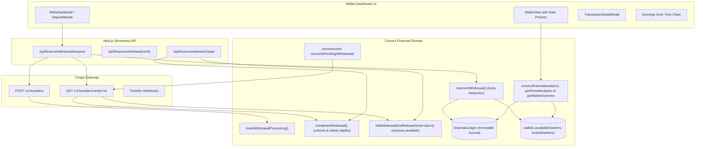

# Withdrawal Lifecycle Fix & Wallet Financial Analytics Implementation Plan

> **For agentic workers:** REQUIRED SUB-SKILL: Use superpowers:subagent-driven-development to implement this plan task-by-task. Steps use checkbox (`- [ ]`) syntax for tracking.

**Goal:** Completely fix the withdrawal lifecycle so funds are never stuck in `lockedBalance`, guarantee automated reconciliation, and implement a full production-grade financial analytics and insights system with interactive charts, date filters, transaction details, and CSV export matching the uploaded UI design.

**Architecture:** 
1. The immutable ledger (`financialLedger`) and double-entry balances in `wallets` remain the authoritative financial source of truth.
2. Explicit domain operations govern the withdrawal lifecycle: `reserveWithdrawal()`, `markWithdrawalProcessing()`, `completeWithdrawal()`, and `failWithdrawalAndReleaseReservation()`, with automated reconciliation crons ensuring stuck requests are recovered.
3. Server-side Convex aggregation in `convex/financial/analytics.ts` computes period-based gaming earnings (Match Winnings - Match Entries), money flow, and lifetime metrics from ledger records without client-side heavy lifting.
4. Rich interactive UI in `src/components/wallet/wallet-view.tsx` with date range selectors, earnings trend line+bar charts, top performance cards, and searchable transaction tables with detail modals and CSV export.

**Architecture Diagram:**

**Tech Stack:** Next.js 16, React 19, TypeScript, Convex 1.45, Clerk Authentication, Chapa API, Tailwind CSS, Lucide icons, Vitest.

---

### Task 1: Complete Explicit Withdrawal Domain Operations in Convex

**Files:**
- Modify: `convex/financial/withdrawals.ts`
- Modify: `convex/lib/validators.ts`
- Test: `convex/__tests__/withdrawals.test.ts`

**Interfaces:**
- `reserveWithdrawal`: verifies available >= totalReserved, deducts available, increases locked, posts `withdrawal_reserve` ledger entry.
- `markWithdrawalProcessing`: updates status to `processing` with `providerTransferId`.
- `completeWithdrawal`: clears locked balance, posts `withdrawal_complete` and `withdrawal_fee`, increments `totalWithdrawn`, marks `completed`. Idempotent if already finalized.
- `failWithdrawalAndReleaseReservation`: restores locked balance back to available, posts `withdrawal_reversal`, marks `failed`/`reversed` with `failureReason`. Idempotent if already finalized.
- `reconcilePendingWithdrawal`: domain query/mutation to inspect and resolve stale withdrawals.

- [ ] **Step 1: Write comprehensive unit test for withdrawal domain operations in `convex/__tests__/withdrawals.test.ts`**
- [ ] **Step 2: Run test to observe any failures**
- [ ] **Step 3: Implement explicit domain operations (`completeWithdrawal`, `failWithdrawalAndReleaseReservation`, etc.) in `convex/financial/withdrawals.ts`**
- [ ] **Step 4: Verify all test cases (A, B, C, D, E, F) pass**
- [ ] **Step 5: Commit changes**

---

### Task 2: Robust Server-Side Transfer Execution & Verification in API Routes

**Files:**
- Modify: `src/app/api/finance/withdrawal/request/route.ts`
- Modify: `src/app/api/finance/withdrawal/verify/route.ts`
- Modify: `src/app/api/finance/webhook/chapa/route.ts`
- Test: `src/lib/payments/__tests__/withdrawal-flow.test.ts`

**Interfaces:**
- `POST /api/finance/withdrawal/request`:
  1. Calls `reserveWithdrawal`.
  2. Dispatches Chapa `initializeTransfer`.
  3. If failed/throws: calls `failWithdrawalAndReleaseReservation`.
  4. If accepted: calls `markWithdrawalProcessing`.
  5. Immediately calls `provider.verifyTransfer`: if already completed/failed, finalizes or releases reservation before returning!
- `POST /api/finance/withdrawal/verify`:
  Queries Chapa transfer verification and calls `completeWithdrawal` or `failWithdrawalAndReleaseReservation`.
- `POST /api/finance/webhook/chapa`:
  Idempotently verifies and finalizes/reverses transfers.

- [ ] **Step 1: Write integration tests for request and verify flows with mocked Chapa client**
- [ ] **Step 2: Update `request/route.ts` to execute immediate verification and settlement**
- [ ] **Step 3: Update `verify/route.ts` and `webhook/chapa/route.ts` to use explicit domain operations**
- [ ] **Step 4: Verify test suite passes**
- [ ] **Step 5: Commit changes**

---

### Task 3: Automatic Background Reconciliation Cron for Pending Withdrawals

**Files:**
- Create: `convex/financial/reconciliation.ts`
- Modify: `convex/crons.ts`
- Modify: `convex/schema.ts` (add indexes for pending reconciliation)

**Interfaces:**
- `reconcilePendingWithdrawals`: internal query finding withdrawals in `"reserved"` or `"processing"`:
  - If `"reserved"` with no provider ID for > 15 mins -> calls `failWithdrawalAndReleaseReservation`.
  - If `"processing"` -> calls Chapa verify HTTP action; settles `completed` or `failed`.
- Cron registered in `convex/crons.ts` running every 1 minute.

- [ ] **Step 1: Write reconciliation logic in `convex/financial/reconciliation.ts`**
- [ ] **Step 2: Register cron in `convex/crons.ts`**
- [ ] **Step 3: Run Convex typecheck and deploy check**
- [ ] **Step 4: Commit changes**

---

### Task 4: Convex Server-Side Analytics & Aggregation Engine

**Files:**
- Create: `convex/financial/analytics.ts`
- Modify: `convex/schema.ts` (add composite indexes on `financialLedger` by `userId` and `createdAt`)
- Test: `convex/__tests__/analytics.test.ts`

**Interfaces:**
- `getWalletOverview(userId)`:
  - Returns Available, Locked, Total balances.
  - Returns Lifetime metrics: Total Deposited, Total Withdrawn, Total Match Entries, Total Match Winnings, Net Gaming Result, Total Chapa Fees, Completed Matches Count, Deposits Count, Withdrawals Count.
- `getPeriodAnalytics(userId, startTimestamp, endTimestamp)`:
  - Aggregates strictly within `[startTimestamp, endTimestamp]`.
  - Returns: Net Gaming Result, Match Winnings, Match Entries, Matches Count, Deposits, Withdrawals, Chapa Fees.
  - Returns Top Performance: Best Day (date & net result), Highest Win (match ID & payout).
  - Returns Time-Series data for chart: array of daily buckets `{ dateLabel, timestamp, netResult, winnings, entries }`.
- `getTransactions(userId, filters)`:
  - Filters by type (`all`, `deposits`, `withdrawals`, `match_entries`, `match_winnings`, `fees`, `adjustments`), status, date range, search query.
- User authorization: strictly enforces `requirePlayer(ctx)` — User A can never query User B.

- [ ] **Step 1: Write test cases in `convex/__tests__/analytics.test.ts` covering acceptance tests 1 to 12**
- [ ] **Step 2: Add schema index on `financialLedger` for `["userId", "createdAt"]` and `["userId", "entryType"]`**
- [ ] **Step 3: Implement `convex/financial/analytics.ts`**
- [ ] **Step 4: Run Vitest and verify all 12 acceptance tests pass**
- [ ] **Step 5: Commit changes**

---

### Task 5: Redesign Wallet Page UI with Financial Insights & Interactive Chart

**Files:**
- Modify: `src/components/wallet/wallet-view.tsx`
- Create: `src/components/wallet/earnings-chart.tsx`
- Create: `src/components/wallet/transaction-detail-modal.tsx`
- Modify: `src/components/wallet/withdraw-modal.tsx` (add active polling / status verification)
- Create: `src/lib/export-csv.ts`

**Features:**
- Header: Title, subtitle, Date Range preset dropdown (`Today`, `Yesterday`, `Last 7 Days`, `Last 30 Days`, `This Month`, `Last Month`, `This Year`, `All Time`, `Custom Range`) with local timezone calendar, and `Export Transactions` CSV button.
- Row 1:
  - Hero Card: Current Wallet Balance (Available, Locked, Total + 3D chess visual + Chapa badge).
  - "Your Earnings" Card: Big bold green Net Gaming Result, percentage trend badge, Match Winnings, Match Entries, Matches Played.
- Row 2:
  - "Earnings Over Time" Chart: Interactive bar + line visualization with hover tooltip.
  - "Money Flow" Card: Money In (Deposits, Match Winnings, Total In) vs Money Out (Withdrawals, Match Entries, Chapa Fees, Total Out).
  - Right Sidebar: Quick Actions (Deposit, Withdraw, History, Bank Accounts, Support), Lifetime Financial Summary card, and "Play More, Earn More" promo card.
- Row 3:
  - "Transaction Overview" Card (counts and sums for selected period).
  - "Top Performance" Card (Best Day, Highest Win).
- Bottom:
  - "Recent Transactions" Table: filter tabs (All, Deposits, Withdrawals, Match Entries, Match Winnings, Fees, Adjustments), search bar, live status badges, and click-to-view detailed transaction modal.

- [ ] **Step 1: Create `src/lib/export-csv.ts` for clean browser transaction CSV export**
- [ ] **Step 2: Create `src/components/wallet/earnings-chart.tsx` for interactive bar+line visualization**
- [ ] **Step 3: Create `src/components/wallet/transaction-detail-modal.tsx` for rich transaction inspection**
- [ ] **Step 4: Update `withdraw-modal.tsx` with polling and instant completion handling**
- [ ] **Step 5: Implement complete layout in `wallet-view.tsx` pixel-matching `media_1790408622009.png`**
- [ ] **Step 6: Commit changes**

---

### Task 6: Full Verification, Deployment, and Git Push

- [ ] **Step 1: Run project typecheck (`npx tsc --noEmit`) to verify 0 errors**
- [ ] **Step 2: Run full Vitest suite (`npx vitest run`) to verify all 611+ tests pass**
- [ ] **Step 3: Run `npx convex dev --once` and `npx convex deploy -y`**
- [ ] **Step 4: Run `next build` to verify production build passes**
- [ ] **Step 5: Git commit and push to `origin main`**
- [ ] **Step 6: Deliver final comprehensive report to user**
