# Castle Chess Admin Dashboard Upgrade — Implementation Plan

> **For agentic workers:** REQUIRED SUB-SKILL: Use superpowers:subagent-driven-development to implement this plan task-by-task. Steps use checkbox (`- [ ]`) syntax for tracking.

**Goal:** Transform the Castle Chess Admin Dashboard into an all-in-one, responsive, production-grade control center matching the exact design system, tokens, and UX quality of the Player Wallet (`wallet-view.tsx`), with zero sidebar, general public audience (no campus/university concepts), and strict server-side authorization.

**Architecture:** A single-page, multi-column dashboard grid with sticky command header, 8 live KPI cards, operational/financial cards, unified transaction table (desktop table + mobile card adaptive layout), interactive detail drawers (Player, Transaction, Feedback), high-friction confirmation dialogs, and backend queries/mutations anchored to the immutable `financialLedger` and protected by `requireAdmin(ctx)`.

**Architecture Diagram:**

```mermaid
graph TD
    subgraph "Server-Side (Convex Auth & Authoritative Ledger)"
        RA[requireAdmin Guard] --> AK[admin.getPlatformKpis]
        RA --> AT[admin.getUnifiedTransactions]
        RA --> AA[admin.getRecentActivity]
        RA --> AP[admin.getPlayerDetails]
        RA --> ASH[admin.getSystemHealth]
        RA --> AWR[admin.finance.setPlayerWalletRestrictions]
        RA --> AML[admin.finance.manualLedgerAdjustment]
        AWR --> FL[financialAuditLogs & wallets]
        AML --> LEDGER[financialLedger]
    end

    subgraph "Client-Side (Single-Page Admin Dashboard)"
        AV[AdminView: Single-Page Container]
        AV --> HDR[Header: Title • System Online • Refresh • Date Preset]
        AV --> KPI[Top 8 KPI Row: Geist Mono • Trends • Sparklines]
        AV --> R1[Row 1: Overview Chart • Pending Actions Queue • Quick Actions]
        AV --> R2[Row 2: Financial Overview • Recent Activity Feed • System Health]
        AV --> R3[Row 3: Unified Transaction History • Feedback Triage • Wallet Security Controls]
    end

    subgraph "Interactive Drawers & Modals"
        R3 --> TDD[TransactionDetailDrawer]
        R3 --> PDD[PlayerDetailDrawer: Profile • Wallet • FairPlay • Audit]
        R3 --> FDM[FeedbackDetailModal: Status • Attachments • Reply]
        AWR --> CD[AdminConfirmDialog: High-Friction Audit Modal]
    end
```



**Tech Stack:** Next.js 15 (App Router), Convex Backend, React 19, Tailwind CSS, Lucide Icons, Sonner Toasts, Clerk Authentication.

**Spec:** [`docs/superpowers/specs/2026-10-06-admin-dashboard-design.md`](file:///c:/Users/USER/Downloads/Castle-3d-multiplayer-with-ai-vercel-eve-nextjs-clerk-main/Castle-3d-multiplayer-with-ai-vercel-eve-nextjs-clerk-main/docs/superpowers/specs/2026-10-06-admin-dashboard-design.md)

## Global Constraints

- **Single-page only**: No sidebar, no nested `/admin/*` routes.
- **Zero university references**: No `universityId`, `universityName`, `playerType: "university_student"`, campus, or student concepts in the admin interface.
- **Authoritative financial labeling**: Label derived values as **Recorded Platform Funds / Float**; never claim external unverified bank balances.
- **Authoritative ledger**: `financialLedger` is the source of truth. No direct balance editing ("set balance = X").
- **Server-side security**: Every admin query and mutation must enforce `requireAdmin(ctx)`.
- **Currency format**: Always format monetary amounts as `X.XX ETB` using `Geist Mono` tabular numerals.
- **Mobile responsiveness**: Zero horizontal scrolling at &ge; 320px width.
- **Theme support**: 100% compliant with both Dark Mode (`#151916`) and Light Mode (`#f5f4ef`).

---

## Tasks

### Task 1: Backend Admin Queries & Server-Side Security Extensions

**Files:**
- Modify: `convex/admin.ts`
- Modify: `convex/admin/finance.ts`
- Test: `convex/__tests__/admin-queries.test.ts`

**Interfaces:**
- Consumes: `requireAdmin(ctx)` from `convex/lib/auth.ts`, `financialLedger`, `wallets`, `players`, `games`, `deposits`, `withdrawals`, `commissions`, `fairPlayReports`, `feedback`.
- Produces:
  - `api.admin.getPlatformKpis`: Query returning 8 KPIs, trends, and pending action counts.
  - `api.admin.getUnifiedTransactions`: Query returning enriched transactions with Chapa reference and player info without double counting.
  - `api.admin.getRecentActivity`: Query returning live chronological activity items.
  - `api.admin.getSystemHealth`: Query returning status for Convex, Chapa, Auth, Webhooks, Database, Cron, Error rate.
  - `api.admin.searchPlayers`: Query returning player profile, balance, ratings, and account status (no university fields).
  - `api.admin.getPlayerDetails`: Query returning deep details for the 4-tab player drawer.
  - `api.admin.finance.setPlayerWalletRestrictions`: Mutation to set deposits, staking, withdrawals, or full freeze with mandatory audit reason and `financialAuditLogs` recording.

- [ ] **Step 1: Write tests for `getPlatformKpis` and `setPlayerWalletRestrictions`**
Create `convex/__tests__/admin-queries.test.ts` verifying that `requireAdmin` blocks non-admins and that `setPlayerWalletRestrictions` updates the wallet flags and writes to `financialAuditLogs`.

- [ ] **Step 2: Run test to verify it fails**
Run: `pnpm vitest run convex/__tests__/admin-queries.test.ts`
Expected: FAIL (functions not yet exported or defined).

- [ ] **Step 3: Implement `getPlatformKpis`, `getRecentActivity`, `getSystemHealth`, `searchPlayers`, `getPlayerDetails`, and `getUnifiedTransactions` in `convex/admin.ts`**
Add the queries to `convex/admin.ts` strictly protected by `requireAdmin(ctx)`:
- `getPlatformKpis`: Computes total players, online now from `userPresence` (`lastSeen < 60s`), active games (`status == 'in_progress'`), recorded platform funds (`approved deposits - completed withdrawals`), locked escrow (in-game stakes), revenue today, deposits today, withdrawals today, and pending action counts.
- `getUnifiedTransactions`: Queries `financialLedger`, joins `players` and provider records (`financialDeposits` / `financialWithdrawals` / `chapaPayments`), mapping to a clean unified list with `ETB` amounts.
- `getRecentActivity`: Gathers latest 15 events across deposits, withdrawals, games, and registrations.
- `getSystemHealth`: Real checks on database, presence, and cron activity with honest `HEALTHY` / `WARNING` / `UNKNOWN` statuses.
- `searchPlayers` and `getPlayerDetails`: Returns player identity (avatar, username, email if authorized, Clerk ID, member since, online status, account status, ratings, wallet balances, fair play reports, and audit history; strictly omitting university fields).

- [ ] **Step 4: Implement `setPlayerWalletRestrictions` in `convex/admin/finance.ts`**
Add `setPlayerWalletRestrictions` mutation with args `{ targetUserId, depositsRestricted, stakingRestricted, withdrawalsRestricted, freezeEntireWallet, reason }`. Validates non-empty reason, updates `wallets`, and writes an immutable entry into `financialAuditLogs` with admin clerk/player ID, previous state, new state, reason, and timestamp.

- [ ] **Step 5: Run tests to verify they pass**
Run: `pnpm vitest run convex/__tests__/admin-queries.test.ts`
Expected: PASS.

- [ ] **Step 6: Commit backend admin functions**
```bash
git add convex/admin.ts convex/admin/finance.ts convex/__tests__/admin-queries.test.ts
git commit -m "feat(admin): add authoritative kpi, unified transactions, and wallet restriction mutations"
```

---

### Task 2: Reusable Admin UI Kit (Design System Alignment with Player Wallet)

**Files:**
- Create: `src/components/admin/ui/kpi-card.tsx`
- Create: `src/components/admin/ui/metric-card.tsx`
- Create: `src/components/admin/ui/status-badge.tsx`
- Create: `src/components/admin/ui/data-table.tsx`
- Create: `src/components/admin/ui/filter-bar.tsx`
- Create: `src/components/admin/ui/confirm-dialog.tsx`
- Create: `src/components/admin/ui/detail-drawer.tsx`
- Test: `src/components/admin/ui/__tests__/kpi-card.test.tsx`

**Interfaces:**
- Consumes: Tailwind classes and tokens from `DESIGN.md` and `wallet-view.tsx` (`bg-card`, `border-border/80`, `rounded-3xl`, `text-foreground`, `font-mono`).
- Produces: Reusable UI primitives used throughout the Admin Dashboard.

- [ ] **Step 1: Write unit tests for `kpi-card.tsx` and `status-badge.tsx`**
Create `src/components/admin/ui/__tests__/kpi-card.test.tsx` testing label, ETB amount formatting in Geist Mono, trend indicator rendering, and loading skeleton.

- [ ] **Step 2: Run test to verify it fails**
Run: `pnpm vitest run src/components/admin/ui/__tests__/kpi-card.test.tsx`
Expected: FAIL (components not found).

- [ ] **Step 3: Implement `kpi-card.tsx` and `metric-card.tsx`**
Build `KpiCard` with:
- Title (`text-[10px] sm:text-[11px] font-bold uppercase tracking-wider text-muted-foreground`)
- Icon container (`flex size-8 items-center justify-center rounded-xl bg-primary/10 text-primary`)
- Value in Geist Mono (`text-xl sm:text-2xl font-mono font-bold tracking-tight text-foreground tabular-nums`) with optional `ETB` label
- Trend badge (`+12.5%` or `-3.2%` with trend icon)
- Subtle SVG micro-sparkline
- Skeleton loader state (`animate-pulse`)

- [ ] **Step 4: Implement `status-badge.tsx`**
Build `StatusBadge` supporting:
- Financial statuses: `Completed` (emerald), `Processing` / `Pending` (amber), `Failed` / `Rejected` (rose), `Reversed` (purple).
- System health: `HEALTHY` (emerald), `WARNING` (amber), `CRITICAL` (rose), `UNKNOWN` (slate).
- Fair play: `Clean` (emerald), `Flagged` / `Under Review` (amber), `Banned` (rose).

- [ ] **Step 5: Implement `data-table.tsx`, `filter-bar.tsx`, `confirm-dialog.tsx`, and `detail-drawer.tsx`**
- `DataTable`: Responsive desktop table (`w-full text-left text-xs`) + mobile adaptive card renderer (0 horizontal scroll overflow).
- `FilterBar`: Segmented pill selector + date range dropdown + search input + CSV export button.
- `ConfirmDialog`: High-friction modal displaying destructive impact, target player/action, required reason input, and confirm button.
- `DetailDrawer`: Accessible sliding sheet (full screen on mobile, 480px–640px slide-over on desktop) with backdrop blur and escape key handling.

- [ ] **Step 6: Run tests to verify they pass**
Run: `pnpm vitest run src/components/admin/ui/__tests__/kpi-card.test.tsx`
Expected: PASS.

- [ ] **Step 7: Commit UI kit**
```bash
git add src/components/admin/ui/
git commit -m "feat(admin): add reusable admin UI kit aligned with player wallet design"
```

---

### Task 3: Interactive Detail Drawers (Player, Transaction & Feedback)

**Files:**
- Create: `src/components/admin/drawers/player-detail-drawer.tsx`
- Create: `src/components/admin/drawers/transaction-detail-drawer.tsx`
- Modify: `src/components/admin/feedback-detail-modal.tsx`
- Test: `src/components/admin/drawers/__tests__/player-detail-drawer.test.tsx`

**Interfaces:**
- Consumes: `api.admin.getPlayerDetails`, `api.admin.finance.setPlayerWalletRestrictions`, `api.feedback.adminUpdateStatus`, `api.feedback.adminUpdateNotes`.
- Produces: Full slide-out inspection workflows for Players, Transactions, and Feedback tickets.

- [ ] **Step 1: Write test for `player-detail-drawer.tsx`**
Verify the 4 tabs render: Profile & Account (without any university field), Wallet & Ledger (ETB balances), Fair Play, and Admin Audit History.

- [ ] **Step 2: Run test to verify it fails**
Run: `pnpm vitest run src/components/admin/drawers/__tests__/player-detail-drawer.test.tsx`
Expected: FAIL.

- [ ] **Step 3: Implement `player-detail-drawer.tsx`**
- Tab 1: Profile & Account (Avatar, username, display name, verification status, email where authorized, Clerk ID, member since, last active, online status, account status). **No university fields**.
- Tab 2: Wallet & Ledger (Available balance ETB, Locked balance ETB, Total deposited ETB, Total withdrawn ETB, Net gaming profit ETB, transaction history list).
- Tab 3: Fair Play (Fair play status, ACPL/telemetry if recorded or `UNKNOWN`, reports against player, previous sanctions, warn/ban actions with confirmation).
- Tab 4: Admin Audit History (Chronological timeline of admin actions targeting this player).
- Targeted Wallet Security Control Bar at the bottom with toggles for Deposits, Staking, Withdrawals, Full Freeze, and required reason field.

- [ ] **Step 4: Implement `transaction-detail-drawer.tsx`**
Reuses the structured receipt pattern from `src/components/wallet/transaction-detail-modal.tsx`:
- Header: Status badge, Amount in ETB (`font-mono`), Date & Time.
- Fee Breakdown: Gross amount, provider fee, net amount.
- Copyable IDs: Internal reference, Chapa transaction ID, idempotency key.
- Player information link to open Player drawer.
- Payment method & description.

- [ ] **Step 5: Polish `feedback-detail-modal.tsx`**
Update to support status transitions (`NEW`, `IN_REVIEW`, `RESOLVED`, `CLOSED`), display attachments, show related game link if available, and allow saving admin notes/responses.

- [ ] **Step 6: Run tests to verify they pass**
Run: `pnpm vitest run src/components/admin/drawers/__tests__/player-detail-drawer.test.tsx`
Expected: PASS.

- [ ] **Step 7: Commit drawers and modals**
```bash
git add src/components/admin/drawers/ src/components/admin/feedback-detail-modal.tsx
git commit -m "feat(admin): add player, transaction, and feedback detail drawers"
```

---

### Task 4: Upgraded Single-Page Admin Dashboard (`admin-view.tsx`)

**Files:**
- Modify: `src/components/admin/admin-view.tsx`
- Modify: `src/app/(protected)/admin/page.tsx`
- Test: `src/components/admin/__tests__/admin-view.test.tsx`

**Interfaces:**
- Consumes: All UI kit components from Task 2, all drawers from Task 3, Convex queries (`getPlatformKpis`, `getUnifiedTransactions`, `getRecentActivity`, `getSystemHealth`, `adminList`).
- Produces: The complete, single-page, responsive Admin Dashboard.

- [ ] **Step 1: Write render tests for `admin-view.tsx`**
Verify that the 8 KPI cards, Financial overview, Pending actions, Quick actions, Recent activity, System health, Transaction history, and Wallet security controls render on the single page without a sidebar.

- [ ] **Step 2: Run test to verify it fails**
Run: `pnpm vitest run src/components/admin/__tests__/admin-view.test.tsx`
Expected: FAIL.

- [ ] **Step 3: Implement sticky header & top 8 KPI row in `admin-view.tsx`**
- Header: "Admin Dashboard", "Monitor and manage Castle Chess operations.", Date & Time snapshot, `<span className="size-2 rounded-full bg-emerald-500 animate-pulse" /> System Online` pill, manual Refresh button, Date range dropdown (`Today`, `Yesterday`, `7 Days`, `30 Days`, `Custom`), and CSV export button.
- Top 8 KPI Grid (`grid grid-cols-2 sm:grid-cols-4 lg:grid-cols-8 gap-3`):
  1. Total Players
  2. Online Now
  3. Active Games
  4. Recorded Platform Funds (`ETB`)
  5. Locked Escrow (`ETB`)
  6. Revenue Today (`ETB`)
  7. Deposits Today (`ETB`)
  8. Withdrawals Today (`ETB`)

- [ ] **Step 4: Implement Row 1 (Overview Live Chart, Pending Actions Queue, Quick Actions)**
- Overview Live Chart: 7-day revenue trend SVG curve with 7-day total revenue, transactions count, and new players count.
- Pending Actions Queue: Cards with badge counts for Pending Withdrawals, Pending Deposits, Failed Payments, Fair Play Reports, User Feedback, and System Alerts (clicking any navigates filter or opens drawer).
- Quick Actions: Buttons for Inspect Player, Process Deposit, Process Withdrawal, Create Tournament, Broadcast Announcement, Manage Puzzles.

- [ ] **Step 5: Implement Row 2 (Financial Overview, Recent Activity, System Health)**
- Financial Overview: Separate metrics for Recorded Platform Balance, User Liabilities, Active Match Escrow, Pending Withdrawal Reserve, Platform Revenue, and Provider Fees.
- Recent Activity Feed: Live list of recent deposits, withdrawals, games, registrations.
- System Health Panel: Multi-service status list (Convex, Chapa, Auth, Webhooks, Database, Cron, Error rate, Latency) with `HEALTHY`, `WARNING`, `CRITICAL`, `UNKNOWN` badges.

- [ ] **Step 6: Implement Row 3 (Unified Transaction History, User Feedback, Wallet Security Controls)**
- Transaction History: Segmented filter pills (`All`, `Deposits`, `Withdrawals`, `Stakes`, `Winnings`, `Commissions`, `Refunds`), search input, desktop table + mobile card adaptive layout, click to open `TransactionDetailDrawer`.
- User Feedback Widget: Tabs for `New`, `In Review`, `Resolved`, feedback list with category badges, click to open `FeedbackDetailModal`.
- Targeted Wallet Security & Freeze Controls: Player search input, current restriction status display, independent toggles (Deposits, Staking, Withdrawals, Freeze Wallet), required reason field, and Apply button triggering `AdminConfirmDialog`.

- [ ] **Step 7: Implement Footer**
Castle Chess Admin version `v2.4`, System security badge ("All systems are running normally. No critical issues detected."), and Last Updated timestamp.

- [ ] **Step 8: Run tests to verify they pass**
Run: `pnpm vitest run src/components/admin/__tests__/admin-view.test.tsx`
Expected: PASS.

- [ ] **Step 9: Commit upgraded single-page admin view**
```bash
git add src/components/admin/admin-view.tsx src/app/\(protected\)/admin/page.tsx src/components/admin/__tests__/admin-view.test.tsx
git commit -m "feat(admin): build upgraded all-in-one responsive admin dashboard"
```

---

### Task 5: Mobile Responsiveness, Dark/Light Theme Verification & Quality Audit

**Files:**
- Modify: `src/components/admin/admin-view.tsx` (responsive adjustments if needed)
- Modify: `src/components/admin/ui/data-table.tsx` (mobile card styling if needed)
- Test: All tests + typecheck + lint

- [ ] **Step 1: Run TypeScript typecheck across entire codebase**
Run: `pnpm run typecheck`
Expected: 0 errors. Fix any typing discrepancies immediately.

- [ ] **Step 2: Run ESLint**
Run: `pnpm run lint`
Expected: 0 errors or warnings in touched admin files.

- [ ] **Step 3: Run Vitest test suite**
Run: `pnpm run test`
Expected: All existing and new tests PASS.

- [ ] **Step 4: Verify mobile layout constraints**
Check that no element causes horizontal overflow at `320px`, `375px`, `768px`, and `1024px`. Verify all touch targets &ge; 44px.

- [ ] **Step 5: Verify Dark and Light Theme tokens**
Verify that all cards, texts, borders, badges, and drawers use semantic theme tokens (`bg-card`, `text-foreground`, `text-muted-foreground`, `border-border/80`, `bg-background`) without hardcoded black/white values that clash in light mode.

- [ ] **Step 6: Commit final polish and verification**
```bash
git add .
git commit -m "chore(admin): verify responsive behavior, themes, typecheck, and tests"
```
