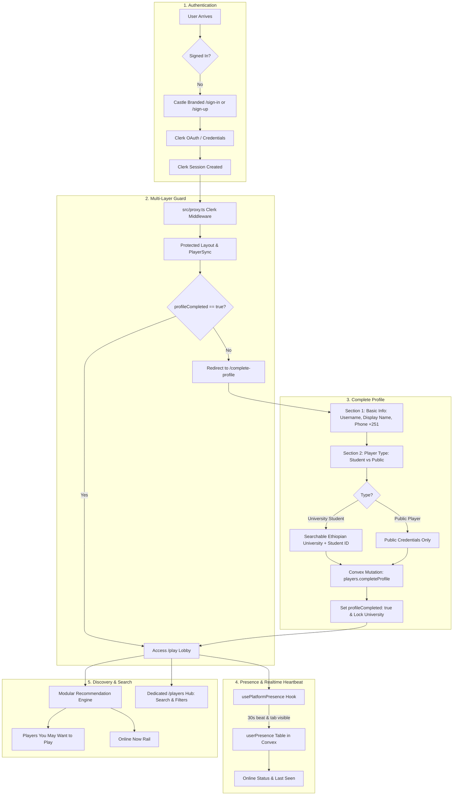

# Castle Chess: Auth, Onboarding, Profile, Presence & Discovery Upgrade
**Design Specification**
**Date:** 2026-10-02
**Status:** Validated Design Spec (Architectural Path)

---

## 1. Executive Summary & Core Objectives

Castle Chess requires a modern, production-grade upgrade across five tightly coupled subsystems:
1. **Authentication & Clerk Branding**: Modernized sign-in/sign-up flows styled in Castle Chess's Study design language (brass `#c9a24a`, walnut `#1c1610`, ivory `#f1e7d3`, knight emblem `♞`), retaining Clerk as the identity provider while clearly documenting Clerk plan capabilities for the "Secured by Clerk" badge.
2. **Mandatory Profile Onboarding & Edge Gating**: A strict, un-bypassable onboarding flow (`/complete-profile`). Newly created accounts cannot access `/play`, `/game/*`, or other dashboard routes until all required attributes are validated and committed.
3. **Required Phone Number & Dual Player Types**: Compulsory international phone collection with a country-code selector (defaulting to Ethiopia `+251`). Strict dual player types: **University Student** (with searchable university combobox and required student ID) and **Public Player**. Complete elimination and prohibition of "University Staff".
4. **University Immutability**: University affiliation and university identity cannot be edited by the user once onboarding is submitted. This invariant is enforced primarily at the Convex mutation layer (not just hidden in the UI).
5. **Real-time Online/Offline Presence & Relative Last-Seen**: High-efficiency, non-polling platform presence system with visibility-aware 30s heartbeats, zero churn on the primary `players` table, and humanized relative last-seen formatting.
6. **Smart Player Discovery & Matchmaking Suggestions**: Modular recommendation engine scoring candidate opponents by rating proximity ($\pm 150$ Elo), online availability, community/university affinity, and social history with rotation jitter. Surfaces "Players You May Want to Play" and "Online Now" in the lobby, alongside a dedicated `/players` discovery hub with multi-filter search.

---

## 2. Architecture & Data Flow



---

## 3. Schema & Database Models (Convex)

### 3.1 `players` Table Additions
In `convex/schema.ts`, extend the `players` table with the following typed fields:

```typescript
// Identity & Profile
displayName: v.optional(v.string()),         // Public display name (distinct from unique username)
phoneNumber: v.optional(v.string()),         // E.164 formatted private phone number
playerType: v.optional(v.union(
  v.literal("university_student"),
  v.literal("public_player")
)),                                          // Strictly 2 player types; no staff
studentId: v.optional(v.string()),           // Required for university_student; private
verificationStatus: v.optional(v.union(
  v.literal("none"),
  v.literal("pending"),
  v.literal("verified")
)),                                          // Student verification status
profileCompleted: v.optional(v.boolean()),    // Mandatory onboarding gate flag
profileCompletedAt: v.optional(v.number()),  // Timestamp of completion (locks university)

// Custom indexes
.index("by_profileCompleted", ["profileCompleted"])
.index("by_playerType", ["playerType"])
.index("by_displayName", ["displayName"])
```

### 3.2 `userPresence` Table
A dedicated presence table decoupled from `players` to prevent subscription churn on user documents:

```typescript
userPresence: defineTable({
  playerId: v.id("players"),
  lastSeen: v.number(),                        // Unix ms of latest heartbeat
  updatedAt: v.number(),
})
  .index("by_playerId", ["playerId"])
  .index("by_lastSeen", ["lastSeen"]),
```

### 3.3 Universities Guarantee
The `universities` table in Convex is already supported. To ensure `listUniversities` always returns stable database IDs (`Id<"universities">`) rather than ephemeral mock strings, `universities.listUniversities` will automatically seed the standard Ethiopian universities from `ETHIOPIAN_UNIVERSITIES_SEED` if empty.

---

## 4. Multi-Layer Onboarding & Route Gating

### Layer 1: Edge Proxy (`src/proxy.ts`)
* Protects `/play`, `/game/*`, `/history`, `/settings`, `/profile`, `/wallet`, `/admin`, `/yyhnan`, `/puzzles`, `/tournaments`, `/feedback`, `/players`.
* Does **not** protect `/complete-profile` with an infinite redirect loop: `/complete-profile` requires authentication (`await auth.protect()`), but does not require profile completion.

### Layer 2: Server-Side Protection (`src/app/(protected)/layout.tsx`)
* Server component runs `await auth.protect()`.
* Loads player state. If `player.profileCompleted !== true`, server redirects to `/complete-profile`.

### Layer 3: Client Sync Guard (`src/components/providers/player-sync.tsx`)
* `PlayerSync` listens to `players.me`.
* If authenticated and `me !== null && !me.profileCompleted`:
  * If current pathname is not `/complete-profile` and not `/sign-in` or `/sign-up`, router immediately redirects to `/complete-profile`.
* If `me !== null && me.profileCompleted` and current pathname is `/complete-profile`:
  * Router redirects to `/play`.

### Layer 4: Backend Mutation Authorization (`requireCompletedPlayer`)
* In `convex/lib/auth.ts`:
  ```typescript
  export async function requireCompletedPlayer(ctx: MutationCtx | QueryCtx): Promise<Doc<"players">> {
    const player = await requirePlayer(ctx);
    if (!player.profileCompleted) {
      throw new Error("profile-incomplete");
    }
    return player;
  }
  ```
* All game actions (`games.create`, `queue.join`, `challenges.createChallenge`, `tournaments.join`) enforce `requireCompletedPlayer`.

---

## 5. Phone Number & Complete Profile Flow (`/complete-profile`)

### 5.1 Phone Number Architecture
* Phone is **mandatory** for every player (both University Students and Public Players).
* International phone component with:
  * Country selector dropdown with flags and dial codes:
    * Default: `+251` (Ethiopia 🇪🇹)
    * Supported major regions: `+1` (US/Canada 🇺🇸), `+44` (UK 🇬🇧), `+254` (Kenya 🇰🇪), `+971` (UAE 🇦🇪), `+49` (Germany 🇩🇪), etc.
  * Number input with auto-formatting and validation:
    * For Ethiopia (`+251`): enforces 9 digits (starting with 9 or 7, e.g. `911 234 567`).
    * General E.164 validation: min 8 digits, max 15 digits.
* Privacy: `phoneNumber` is strictly private and stripped from all public projections (`players.getByUsername`, `players.discoverRecommended`, `players.getOnlinePlayers`, etc.).

### 5.2 Form UX & Sections
* Divided into progressive, clear sections:
  1. **Section 1: Basic Information**
     * Avatar preview (from Clerk with fallback initials).
     * **Username**: Lowercase alphanumeric + hyphens/underscores (3-20 chars). Debounced live availability check via `players.checkUsernameAvailability` query.
     * **Display Name**: Player's preferred public display name (2-30 chars).
     * **Phone Number**: Country selector + local number input with live format validation.
  2. **Section 2: Player Type**
     * Two cards:
       * **University Student**: "Verify your university identity and participate in university chess competitions."
       * **Public Player**: "Play Castle Chess without university affiliation."
     * Active state: High-contrast brass border, glowing background accent, selected checkmark.
     * **Staff type completely omitted**.
  3. **Section 3: University Affiliation (Students only)**
     * Searchable Combobox for Ethiopian Universities (querying `universities.listUniversities`).
     * Real `universityId` stored.
     * **Student ID**: Required text input.
     * Status indicator: "Verification Pending" (amber badge).

---

## 6. University Immutability & Safety Rules

1. In `convex/players.ts`:
   * `completeProfile` mutation:
     * Validates input: username unique & valid, displayName non-empty, phone valid, playerType valid.
     * If `university_student`: requires valid `universityId` and `studentId`.
     * Once set, marks `profileCompleted: true`, `profileCompletedAt: Date.now()`.
     * Also updates university roster counts atomically.
2. In `convex/universities.ts`:
   * `joinUniversity` and `leaveUniversity`:
     * If `player.profileCompleted === true` and `player.playerType === "university_student"`:
       ```typescript
       if (player.profileCompleted && player.universityId) {
         throw new Error("university-immutable-after-profile-completion");
       }
       ```
3. In `convex/players.ts` (`updateProfile`):
   * Prohibits changing `universityId`, `studentId`, or `playerType` once completed.
   * Throws `"identity-fields-immutable"`.

---

## 7. Online/Offline Presence & Relative Time System

### 7.1 Presence Engine Design
* **Heartbeat Interval**: 30,000 ms (30 s).
* **Visibility Awareness**: Only fires when `document.visibilityState === "visible"`.
* **Session Lifecycle**: On `beforeunload` or component unmount, fires beacon or sets unmount timestamp.
* **Offline Threshold**: `PRESENCE_OFFLINE_THRESHOLD_MS = 60_000` (60 s).
  * If `now - lastSeen <= 60_000` $\rightarrow$ **Online** (green indicator).
  * Otherwise $\rightarrow$ **Offline** with relative time.

### 7.2 Humanized Relative Time Formatting
Helper function `formatPresenceLastSeen(lastSeenMs: number, nowMs: number)`:
* $< 60$ s: `"Online"` / `"Active now"`
* $1 - 59$ min: `"Last seen 1 min ago"`, `"Last seen 18 min ago"`
* $1 - 23$ hours: `"Last seen 2 hours ago"`
* $1$ day (24-48h): `"Last seen yesterday"`
* $> 2$ days: `"Last seen Oct 1"` (formatted date)

---

## 8. Player Discovery & Recommendation Algorithm

### 8.1 Composite Scoring Model
The Convex query `players.discoverRecommended(limit: 6)` computes:
$$\text{Score}(P) = w_r \cdot S_r + w_a \cdot S_a + w_c \cdot S_c + w_s \cdot S_s + S_{\text{jitter}}$$

1. **Rating Proximity ($S_r$, weight 0.35)**:
   $$S_r = \max\left(0, 1 - \frac{|\text{rating}_P - \text{rating}_{\text{me}}|}{500}\right)$$
2. **Activity & Availability ($S_a$, weight 0.30)**:
   * Online ($< 60$s): $1.0$
   * Active within 1 hour: $0.6$
   * Active within 24 hours: $0.3$
   * Stale: $0.05$
3. **Campus / Community Affinity ($S_c$, weight 0.15)**:
   * If both are students from same university: $1.0$
   * If both are university students: $0.7$
   * Otherwise: $0.3$
4. **Social History ($S_s$, weight 0.10)**:
   * Friends or prior games played together: $0.8$
   * New encounter: $0.5$
5. **Diversity Jitter ($S_{\text{jitter}}$, weight 0.10)**:
   * Deterministic hash `hash(myId + candidateId + currentHour) % 100 / 1000` to smoothly rotate recommendations across visits.

### 8.2 UI Integration
* **In `/play` Lobby**:
  * **"Players You May Want to Play"**: Clean responsive card grid. Displays Avatar, Username, Display Name, Rating, Online/Last-seen badge, University badge, and `[ Challenge ]` + `[ View Profile ]` buttons.
  * **"Online Now"**: Horizontal scrollable pill strip of active players with direct challenge triggers.
  * **"Find an Opponent"**: Smart matchmaking launcher modal with time control and rating bracket.
* **Dedicated `/players` Hub**:
  * Full search by Username and Display Name.
  * Filters: Rating Range, Online Now toggle, University dropdown, Player Type filter.
  * Paginated/virtualized list.

---

## 9. Player Profile Page (`/profile/[username]`) Upgrade

* Enhanced header & dashboard:
  * Profile Picture/Avatar
  * Display Name + `@username`
  * Rating & Tier badge
  * Player Type badge (University Student vs Public Player)
  * Verified University Badge with campus link (if student)
  * Real-time Online/Offline indicator + Last Seen timestamp
  * Match Statistics: Games, Wins, Losses, Draws, Win Percentage
  * Action Buttons: `[ Challenge ]`, `[ Add Friend ]`, `[ Share Profile ]`
  * Recent Match History
* Strict PII Redaction: `phoneNumber` and `studentId` are never rendered.

---

## 10. Clerk Plan & "Secured by Clerk" Analysis

* **Finding**: The production Clerk publishable key in `.env.local` is `pk_live_Y2xlcmsuYWJheWNoZXNzLmNvbSQ`.
* **Technical constraint**: Clerk's official mechanism to remove the "Secured by Clerk" badge on prebuilt components (`<SignIn />`, `<SignUp />`, `<UserButton />`) is managed via the **Clerk Dashboard** under **Settings $\rightarrow$ Customization $\rightarrow$ Branding**, which requires an active paid plan (Pro/Enterprise).
* **Compliance**: We will not apply brittle CSS display:none hacks that violate Clerk's license or break on DOM updates. We will apply comprehensive Castle Chess Study theming (colors, typography, radii, cards, logos) and document this dashboard switch clearly in the final report.

---

## 11. University Staff Data & Migration Safety

* **Database Inspection Findings**:
  * Queried all 16 existing player records in Convex via MCP `data` query.
  * **Result**: Zero records contain a "University Staff" role or player type.
  * No destructive migration is required. The schema update cleanly introduces `playerType: v.union(v.literal("university_student"), v.literal("public_player"))` and strictly prevents creation of any staff records.

---

## 12. Implementation Plan Breakdown

| Phase | Milestone | Key Artifacts |
|---|---|---|
| **Phase 1** | Schema & Backend Functions | `convex/schema.ts`, `convex/players.ts`, `convex/presence.ts`, `convex/lib/auth.ts`, `convex/universities.ts` |
| **Phase 2** | Auth & Onboarding Flow | `src/app/sign-in/`, `src/app/sign-up/`, `src/app/complete-profile/`, phone selector component |
| **Phase 3** | Presence Engine & Hook | `src/hooks/use-platform-presence.ts`, `src/components/providers/player-sync.tsx` |
| **Phase 4** | Discovery & Matchmaking UI | `src/components/players/`, `src/components/play/`, `src/app/(protected)/players/page.tsx` |
| **Phase 5** | Profile Page & Settings | `src/components/profile/profile-header.tsx`, `src/app/(protected)/profile/[username]/page.tsx` |
| **Phase 6** | Automated Tests & Verification | Convex integration tests, vitest suite, edge gate tests |

---
