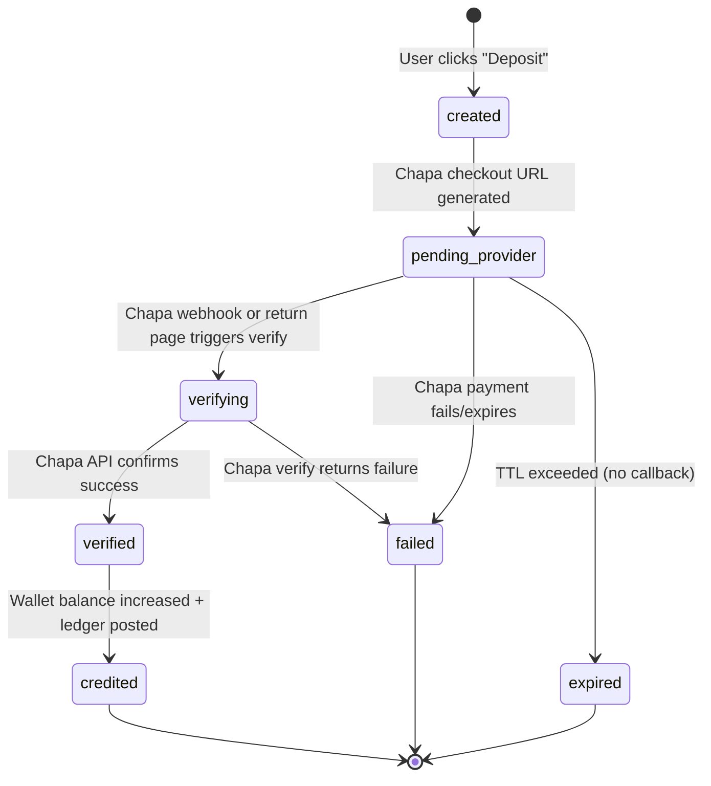
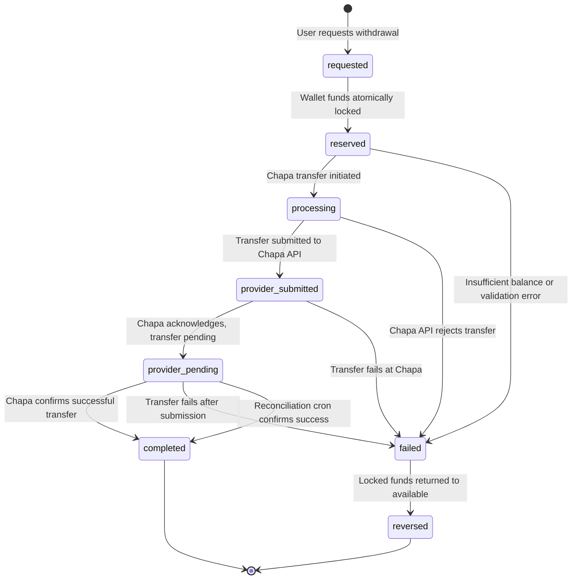
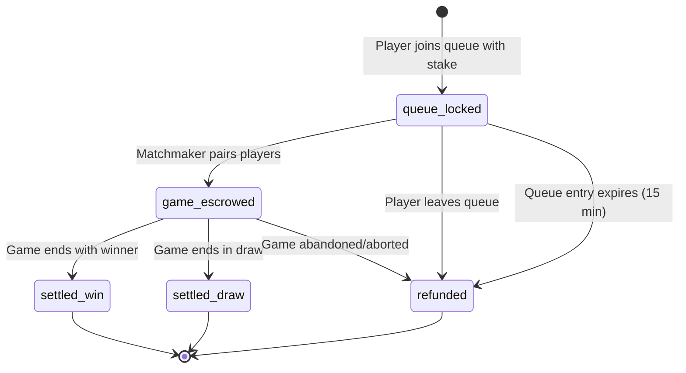

# Financial State Machine — Castle Chess

## Overview

All monetary amounts are stored as **santims** (integer minor units, 1 ETB = 100 santims).
All financial mutations are **idempotent** (via `idempotencyKey` on `financialLedger`).
The `financialLedger` table is **append-only** — entries are never modified or deleted.

---

## 1. Deposit State Machine



### States (stored in `financialDeposits.status`)

| State | Description |
|-------|-------------|
| `created` | Deposit record created, Chapa session not yet initialized |
| `pending_provider` | Chapa checkout URL generated, user redirected to Chapa |
| `verifying` | Payment callback received, verification in progress |
| `verified` | Chapa confirms payment success |
| `credited` | Wallet credited, ledger entry posted (terminal success) |
| `failed` | Payment failed at provider level (terminal failure) |
| `expired` | Payment window expired without completion (terminal) |

### Idempotency Keys
- Deposit credit: `deposit_credit_{depositId}`
- Deposit fee: `deposit_fee_{depositId}`

---

## 2. Withdrawal State Machine



### States (stored in `financialWithdrawals.status`)

| State | Description |
|-------|-------------|
| `requested` | User submitted withdrawal request |
| `reserved` | Wallet funds moved from available to locked |
| `processing` | System is initiating Chapa transfer |
| `provider_submitted` | Transfer API call made to Chapa |
| `provider_pending` | Chapa acknowledged but not yet settled |
| `completed` | Funds successfully transferred (terminal success) |
| `failed` | Transfer failed at any stage |
| `reversed` | Failed withdrawal funds returned to available balance (terminal) |
| `cancelled` | User or admin cancelled before provider submission (terminal) |

### Reservation Accounting
```
Total wallet deduction = requestedAmount + chapaFee
Available balance → -totalReserved
Locked balance   → +totalReserved
```

### Reconciliation Cron
- Runs every 60 seconds (`reconcile pending withdrawals`)
- Queries Chapa transfer status for all `reserved`/`processing`/`provider_pending` withdrawals
- Auto-releases stuck reservations older than 5 minutes with no provider reference
- On success: locked → 0, records `withdrawal_complete` ledger entry
- On failure: locked → available, records `withdrawal_reversal` ledger entry

---

## 3. Match Escrow State Machine



### Escrow Flow

1. **Queue Join (stake > 0)**
   - Verify `available >= stake`
   - `available -= stake`, `locked += stake`
   - Ledger: `match_lock`

2. **Queue Leave / Expire**
   - `available += stake`, `locked -= stake`
   - Ledger: `match_unlock`

3. **Game Creation (pairing)**
   - Both players' stakes already locked
   - Game record stores: `stake`, `escrowTotal` (stake × 2), `commission`, `payout`
   - `escrowSettled = false`

4. **Win Settlement**
   - Loser: `locked -= stake` (loss consumed)
   - Winner: `locked -= stake`, `available += payout`
   - Platform: `available += commission` (admin wallet)
   - Ledger: `match_loss`, `match_payout`, `platform_commission`
   - Commission rate: 10% of total pool

5. **Draw Settlement**
   - Both players: `locked -= stake`, `available += stake`
   - Ledger: `match_unlock`
   - No commission charged

6. **Escrow Finalization**
   - `game.escrowSettled = true` (prevents double settlement)
   - Idempotency: `match_payout_{winnerId}_{gameId}`, etc.

---

## 4. Fee Model

### Deposit Fees (Chapa)
- Rate: Configurable via `financialConfig.depositFeeRateBasisPoints` (default: 260 = 2.6%)
- Mode: `additive` (fee added on top) or `deduct_from_gross`
- Formula (additive): `grossAmount = creditAmount / (1 - feeRate)`
- Fee includes VAT (2.6% is VAT-inclusive)

### Withdrawal Fees (Chapa)
- Rate: Configurable via `financialConfig.withdrawalFeeRateBasisPoints` (default: 260 = 2.6%)
- Total deduction: `userReceives + chapaFee`
- Fee calculated on the amount the user wants to RECEIVE

### Match Commission
- Rate: 10% of total escrow pool (`COMMISSION_RATE = 0.1`)
- Applied only on wins (not draws)
- Credited directly to admin wallet

---

## 5. Wallet Balance Invariants

```
availableBalance >= 0           (always)
lockedBalance >= 0              (always)
totalBalance = available + locked
availableSantims = round(availableBalance * 100)
```

All balance modifications MUST:
1. Read current balances
2. Compute new balances
3. Post ledger entry with idempotency key
4. Patch wallet atomically
5. Never allow negative balances

### Wallet Statuses
- `active` — Normal operations
- `frozen` — Admin freeze, no transactions allowed
- `restricted` — Limited operations (future use)

---

## 6. Provider Abstraction

```
Wallet (internal) ← → PaymentService ← → ChapaAdapter ← → Chapa API
```

- `src/lib/payments/provider.ts` — Factory returning provider adapter
- `src/lib/payments/chapa/adapter.ts` — Chapa-specific implementation
- `src/lib/payments/money.ts` — ETB ↔ santims conversion helpers

The wallet is the source of truth. Chapa is an external payment provider that can be replaced.
