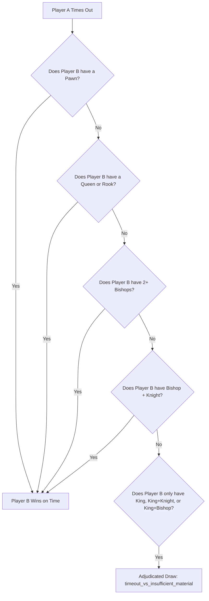
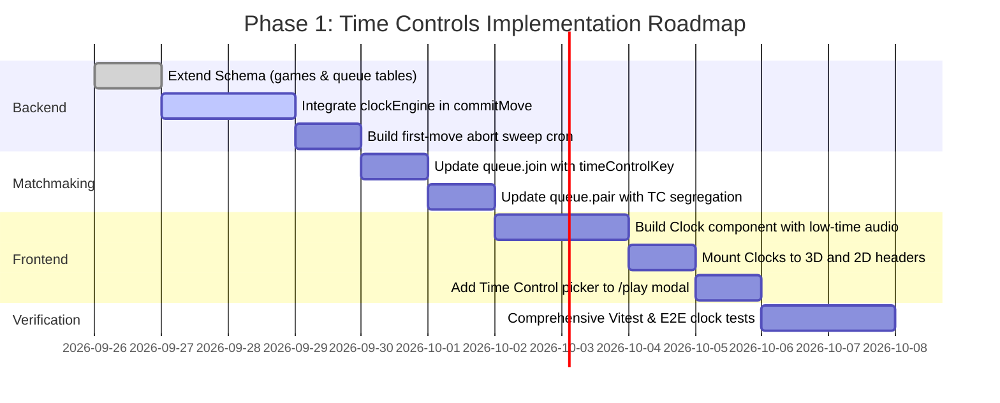

# Castle Chess — Time Control Architecture Specification

> [!IMPORTANT]
> **STATUS: TO BE IMPLEMENTED FOR PHASE 1**  
> This specification defines the authoritative time control architecture scheduled for primary implementation in Phase 1. Draft helpers exist in `convex/lib/clockEngine.ts` and `convex/lib/timeControl.ts` with passing unit tests (`convex/__tests__/clock.test.ts`), but full production schema binding, queue segregation, and UI integration will be completed in Phase 1.

**Author:** Castle Chess Core Architecture Team  
**Date:** 2026-09-26  
**Target Release:** Castle Chess v2.5 (Phase 1)

---

## 1. Overview & Objectives

In competitive online chess, time is as vital as material. A robust time control system requires:
1. **Absolute Server Authority:** The client's clock is purely a visual projection. The server alone records move arrival timestamps, deducts elapsed time, grants increments, and declares timeouts.
2. **Lag Compensation & Fair Play:** Network latency must not unfairly drain a player's clock, nor should client tampering be able to halt time.
3. **FIDE Compliance:** Precise support for Fischer increments, Bronstein delays, first-move aborts, and timeout vs insufficient material draws.

---

## 2. Timing Models & Presets

### 2.1 Supported Timing Modes
1. **Fischer Increment:**
   - A fixed increment (`incrementMs`) is added to the player's clock immediately upon completing their move.
   - Example: In `3+2` Blitz, each player begins with 180 seconds, and 2 seconds are added after each move.
2. **Bronstein Delay:**
   - The clock pauses for a delay period (`delayMs`). If the move takes less than `delayMs`, no time is deducted. If the move takes longer, only the time exceeding `delayMs` is deducted. Clock time can never exceed its pre-move value.
3. **Simple / USCF Delay:**
   - The clock visibly holds still for `delayMs` before beginning to count down.
4. **Unlimited / Casual:**
   - No countdown timer (`baseTimeMs = 0`, `incrementMs = 0`, `delayMs = 0`). Used in unrated casual and local games.

### 2.2 Standard Presets Matrix
All time controls are classified using the estimated game duration formula:
$$\text{Estimated Duration (minutes)} = \frac{\text{baseTimeMs} + 40 \times \text{incrementMs}}{60,000}$$

| Category | Preset Key | Base Time | Increment | Delay | Est. Duration | Target Play Style |
|---|---|---|---|---|---|---|
| **Bullet** | `bullet_1_0` | 1 min (60,000 ms) | 0 s | 0 s | 1.0 min | Hyper-fast reflex |
| **Bullet** | `bullet_1_1` | 1 min (60,000 ms) | 1 s | 0 s | 1.67 min | Standard bullet |
| **Bullet** | `bullet_2_1` | 2 min (120,000 ms) | 1 s | 0 s | 2.67 min | Extended bullet |
| **Blitz** | `blitz_3_0` | 3 min (180,000 ms) | 0 s | 0 s | 3.0 min | Pure speed blitz |
| **Blitz** | `blitz_3_2` | 3 min (180,000 ms) | 2 s | 0 s | 4.33 min | FIDE blitz standard |
| **Blitz** | `blitz_5_0` | 5 min (300,000 ms) | 0 s | 0 s | 5.0 min | Classic 5-minute |
| **Blitz** | `blitz_5_3` | 5 min (300,000 ms) | 3 s | 0 s | 7.0 min | Competitive blitz |
| **Blitz** | `blitz_5_5` | 5 min (300,000 ms) | 5 s | 0 s | 8.33 min | Deep blitz |
| **Rapid** | `rapid_10_0` | 10 min (600,000 ms) | 0 s | 0 s | 10.0 min | Coffeehouse rapid |
| **Rapid** | `rapid_10_5` | 10 min (600,000 ms) | 5 s | 0 s | 13.33 min | Competitive rapid |
| **Rapid** | `rapid_15_10` | 15 min (900,000 ms) | 10 s | 0 s | 21.67 min | FIDE rapid standard |
| **Rapid** | `rapid_30_0` | 30 min (1,800,000 ms) | 0 s | 0 s | 30.0 min | Serious study rapid |
| **Classical**| `classical_45_15`| 45 min (2,700,000 ms)| 15 s | 0 s | 55.0 min | Club tournament |
| **Classical**| `classical_60_0` | 60 min (3,600,000 ms)| 0 s | 0 s | 60.0 min | Standard classical |
| **Classical**| `classical_90_30`| 90 min (5,400,000 ms)| 30 s | 0 s | 110.0 min | World championship |
| **Unlimited**| `unlimited` | 0 ms | 0 s | 0 s | ∞ | Casual / Tutorial |

---

## 3. Server-Authoritative Clock Math

### 3.1 State Representation
Each active timed game maintains the following authoritative state:
```typescript
export interface ClockState {
  whiteTimeMs: number;
  blackTimeMs: number;
  activeColor: "w" | "b";
  lastTickAt: number;        // Server epoch milliseconds of the last move/tick
  moveCount: number;         // Total plies committed
  clockVersion: number;      // Monotonically increasing sync barrier
}

export interface ClockConfig {
  baseTimeMs: number;
  incrementMs: number;
  delayMs: number;
}
```

### 3.2 Elapsed Time Deduction Algorithm
When a move arrives at the server at timestamp `serverNow`:
```typescript
export function applyMoveToClockServer(
  state: ClockState,
  config: ClockConfig,
  serverNow: number
): ClockState {
  // If first move of the game, clock starts ticking for Black without deducting from White
  if (state.lastTickAt === 0 || state.moveCount === 0) {
    return {
      ...state,
      activeColor: state.activeColor === "w" ? "b" : "w",
      lastTickAt: serverNow,
      moveCount: state.moveCount + 1,
      clockVersion: state.clockVersion + 1,
    };
  }

  const elapsed = Math.max(0, serverNow - state.lastTickAt);
  const effectiveElapsed = Math.max(0, elapsed - config.delayMs);

  let newWhiteTime = state.whiteTimeMs;
  let newBlackTime = state.blackTimeMs;

  if (state.activeColor === "w") {
    newWhiteTime -= effectiveElapsed;
    if (newWhiteTime <= 0) {
      return { ...state, whiteTimeMs: 0, lastTickAt: serverNow, clockVersion: state.clockVersion + 1 };
    }
    newWhiteTime += config.incrementMs;
  } else {
    newBlackTime -= effectiveElapsed;
    if (newBlackTime <= 0) {
      return { ...state, blackTimeMs: 0, lastTickAt: serverNow, clockVersion: state.clockVersion + 1 };
    }
    newBlackTime += config.incrementMs;
  }

  return {
    whiteTimeMs: newWhiteTime,
    blackTimeMs: newBlackTime,
    activeColor: state.activeColor === "w" ? "b" : "w",
    lastTickAt: serverNow,
    moveCount: state.moveCount + 1,
    clockVersion: state.clockVersion + 1,
  };
}
```

### 3.3 Visual Projection for Clients
Clients subscribe to `games` table reactive updates. Between server mutations, the client calculates its live display time smoothly at 60 FPS:
$$\text{ProjectedTime} = \text{RemainingMs} - (\text{ClientNow} - \text{ClientLastReceivedTick})$$
Any drift is reconciled automatically on the next mutation without visual hitching.

---

## 4. Timeout Adjudication & Insufficient Material

Under FIDE Article 6.9, if a player runs out of time:
- The game is won by the opponent **unless** the opponent cannot possibly checkmate the player by any series of legal moves. In that case, the game is a **draw**.

### 4.1 Mating Material Evaluation Matrix
When Player A times out, Player B's pieces are evaluated:



### 4.2 Implementation
```typescript
export function determineTimeoutResult(
  timedOutColor: "w" | "b",
  fen: string
): { winner: "w" | "b" | "draw"; endReason: string } {
  const chess = new Chess(fen);
  const winnerColor = timedOutColor === "w" ? "b" : "w";
  const board = chess.board();

  let hasPawn = false;
  let hasRook = false;
  let hasQueen = false;
  let bishops = 0;
  let knights = 0;

  for (const row of board) {
    for (const piece of row) {
      if (piece && piece.color === winnerColor) {
        if (piece.type === "p") hasPawn = true;
        if (piece.type === "r") hasRook = true;
        if (piece.type === "q") hasQueen = true;
        if (piece.type === "b") bishops++;
        if (piece.type === "n") knights++;
      }
    }
  }

  const hasMatingMaterial =
    hasPawn || hasRook || hasQueen || (bishops >= 2) || (bishops >= 1 && knights >= 1);

  if (!hasMatingMaterial) {
    return { winner: "draw", endReason: "timeout_vs_insufficient_material" };
  }

  return { winner: winnerColor, endReason: "timeout" };
}
```

---

## 5. Aborts and Disconnection Handling

### 5.1 First-Move 60s Abort
1. When an online rated game is paired, `firstMoveDeadlineAt = createdAt + 60,000`.
2. If White does not make their first move before `firstMoveDeadlineAt`:
   - Game status is set to `"aborted"`.
   - Both players' escrowed stakes are refunded 100% to their wallets via `match_unlock`.
   - Neither player experiences rating delta.
3. If White plays move 1, Black is granted 60s for move 1. If Black fails to move, the game is similarly aborted or forfeited.

### 5.2 Disconnection & Reconnection Grace
- Presence is tracked via the `presence` table (`lastSeen` timestamp updated every 5 seconds).
- If an active player's connection drops:
  - A 60-second reconnection grace timer is activated.
  - The board displays a *"Player Reconnecting..."* badge.
  - If the player reconnects before 60s, gameplay resumes seamlessly.
  - If the grace timer expires or the player's chess clock reaches 0, the game is forfeited to the opponent.

---

## 6. Phase 1 Implementation Plan



---

## 7. Database Schema Extension Reference

The following fields will be formalized on the `games` table in Phase 1:
```typescript
timeControlKey: v.optional(v.string()),         // e.g. "blitz_3_2"
timeCategory: v.optional(vTimeCategory),        // "bullet" | "blitz" | "rapid" | "classical"
clockMode: v.optional(vClockMode),              // "fischer" | "bronstein" | "none"
baseTimeMs: v.optional(v.number()),             // e.g. 180000
incrementMs: v.optional(v.number()),            // e.g. 2000
delayMs: v.optional(v.number()),                // e.g. 0
whiteTimeMs: v.optional(v.number()),            // e.g. 178500
blackTimeMs: v.optional(v.number()),            // e.g. 180000
lastTickAt: v.optional(v.number()),             // e.g. 1774889200000
clockVersion: v.optional(v.number()),           // e.g. 4
firstMoveDeadlineAt: v.optional(v.number()),    // e.g. 1774889260000
```
